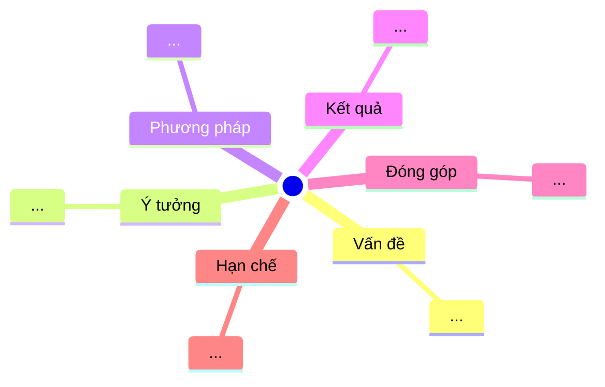

# Paper Mindmap Worker

This skill renders a paper as a mindmap so its structure and concept hierarchy can
be grasped at a glance. It emits Mermaid `mindmap` syntax plus a plain Markdown
outline fallback (not every renderer supports `mindmap`).

## Conventions
This skill treats `.claude/rules/research-conventions.md` as binding for input
resolution, Vietnamese-with-preserved-terms labels, `notes/` location, and fidelity.

## Procedure
1. **Resolve the target** from `$ARGUMENTS` per the shared rules; if empty, it asks.
   For `all`, it produces one mindmap per paper.
2. **Read the PDF** with the Read tool.
3. **Build the hierarchy.** Root = the paper's short title. Main branches =
   Vấn đề (Problem), Ý tưởng (Core idea), Phương pháp (Method components),
   Thực nghiệm (Experiments), Kết quả (Results), Đóng góp (Contributions),
   Hạn chế (Limitations). Leaves = the specifics under each.
4. **Keep labels short** and free of characters that break Mermaid (`()`, `:`, `,`);
   when a label needs them, it wraps the label in double quotes.
5. **Emit both forms** — the Mermaid block and the outline fallback — then the
   glossary.
6. **Save and preview** to `notes/<id>-mindmap.md` and print the saved path.

## Output template (`notes/<id>-mindmap.md`)
````
# Sơ đồ tư duy — <id> · <Title>
> Nguồn: <filename> · Worker: paper-mindmap · Ngày: <YYYY-MM-DD>



## Dạng outline (fallback)
- **Vấn đề** — ...
- **Ý tưởng** — ...
- ...

## Thuật ngữ (Glossary)
````
