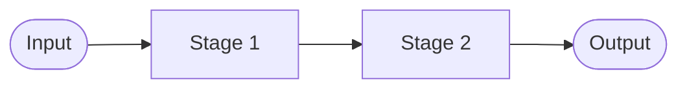

# Pipeline Extract Worker

This skill reconstructs a paper's method as an end-to-end pipeline a reader could
implement: ordered stages from raw input to final output, each with its inputs,
operation, and outputs, plus a flow diagram. It is the structural recipe; for
assumptions, novelty, and a reproducibility verdict the user should use
`methodology-read`.

## Conventions
This skill treats `.claude/rules/research-conventions.md` as binding for input
resolution, Vietnamese-with-preserved-terms output, `notes/` location, and fidelity.

**LaTeX (§7 of shared rule).** All equations, objective functions, and key
mathematical expressions within a stage's "Operation" field must be written in
LaTeX: `$...$` inline, `$$...$$` for standalone equations. Never write math as
raw ASCII in stage descriptions.

## Procedure
1. **Resolve the target** from `$ARGUMENTS` per the shared rules; if empty, it asks.
2. **Read the PDF**, focusing on the method and implementation details.
3. **Trace the end-to-end flow** from raw input to final output.
4. **Decompose into ordered stages.** For each stage it records: name, input,
   operation (what it does and how — key parameters, equations, module/network used),
   and output.
5. **Capture data prep and post-processing** as their own stages.
6. **Draw the flow** as a Mermaid `flowchart` (input → stages → output).
7. **Flag gaps** — steps the paper leaves unspecified that would block
   reimplementation (and points to `methodology-read` for the full repro checklist).
8. **Glossary, save, preview** to `notes/<id>-pipeline.md`.

## Output template (`notes/<id>-pipeline.md`)
````
# Pipeline — <id> · <Title>
> Nguồn: <filename> · Worker: pipeline-extract · Ngày: <YYYY-MM-DD>

## Tổng quan luồng (Flow overview)


## Các giai đoạn (Stages)
### Stage 1 — <tên>
- **Input:** ...
- **Operation:** ... (tham số / công thức chính — viết bằng LaTeX, vd. $f(\mathbf{x}) = \mathbf{W}\mathbf{x} + \mathbf{b}$)
- **Output:** ...

## Tiền xử lý & hậu xử lý (Pre/Post-processing)
## Chỗ thiếu để tái lập (Gaps blocking reimplementation)
## Thuật ngữ (Glossary)
````
