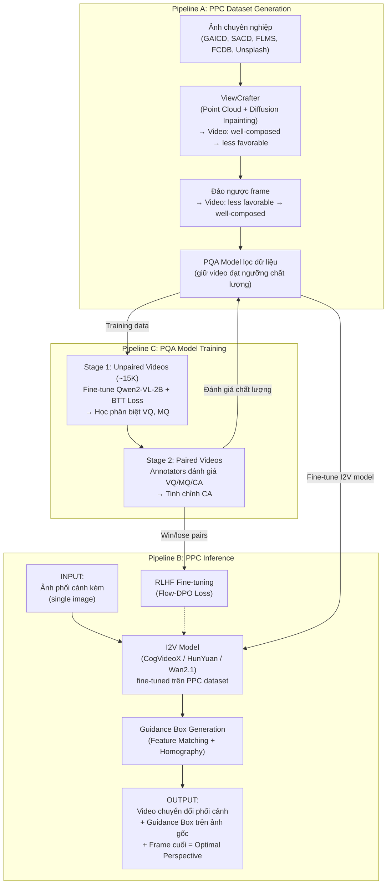

# Pipeline Extract — Bài báo 001

| Trường | Nội dung |
|--------|----------|
| **Paper ID** | 001 |
| **Tiêu đề** | Photography Perspective Composition: Towards Aesthetic Perspective Recommendation |
| **Source file** | `001_Photography_Perspective_Composition_Towards_Aesthetic_Perspective_Recommendation.pdf` |
| **Worker** | pipeline-extract |
| **Ngày** | 2026-06-18 |

---

## 1. Tổng quan hệ thống

Bài báo đề xuất bài toán mới: **photography perspective composition (PPC)** — khác với các phương pháp cropping 2D truyền thống, PPC tái cấu trúc phối cảnh (perspective) trong không gian 3D bằng cách điều chỉnh mối quan hệ không gian giữa các chủ thể (subjects).

### Input tổng thể
- Một ảnh chụp tĩnh (single image) có phối cảnh kém (less favorable / suboptimal perspective), được chụp từ góc nhìn bất kỳ của người dùng thông thường.
- Không yêu cầu thêm: không cần prompt text, không cần camera trajectory rõ ràng.

### Output tổng thể
- Một **video chuyển đổi phối cảnh** (perspective transformation video): video ngắn thể hiện quá trình dịch chuyển từ phối cảnh ban đầu (kém thẩm mỹ) sang phối cảnh được tối ưu hóa thẩm mỹ (aesthetically enhanced perspective).
- Frame cuối cùng của video = **phối cảnh tối ưu được đề xuất** (optimal perspective recommendation).
- Kèm theo: một **guidance box** (hộp hướng dẫn) được chiếu ngược lên ảnh gốc để hướng dẫn người dùng di chuyển camera.

---

## 2. Kiến trúc pipeline tổng thể

Hệ thống gồm **ba pipeline** hoạt động kết hợp:

| # | Tên pipeline | Mục đích |
|---|-------------|---------|
| A | **PPC Dataset Generation** | Xây dựng dữ liệu training tự động từ ảnh chuyên nghiệp |
| B | **Photography Perspective Composition (PPC)** | Model sinh video chuyển đổi phối cảnh (inference) |
| C | **Perspective Quality Assessment (PQA) Model** | Đánh giá chất lượng video phối cảnh, phục vụ lọc data và RLHF |

---

## 3. Pipeline A — Xây dựng dataset PPC tự động

**Nguyên lý cốt lõi:** Do không có dataset PPC sẵn, nhóm tác giả dùng chiến lược *đảo ngược* (reverse): từ ảnh chuyên nghiệp (well-composed) sinh ra chuỗi video chuyển từ tốt → xấu, rồi đảo ngược để thu được dữ liệu chuyển từ xấu → tốt.

### Bước A1 — Thu thập ảnh chuyên nghiệp (Data Source)

| | Chi tiết |
|-|---------|
| **Input** | Các dataset ảnh chuyên nghiệp: GAICD, SACD, FLMS, FCDB; bổ sung Unsplash |
| **Output** | Tập ảnh well-composed làm điểm xuất phát |
| **Kỹ thuật** | Thu thập từ các nguồn open-source; Unsplash là dataset open-source lớn nhất |

### Bước A2 — Sinh video chuyển đổi phối cảnh (Perspective Transformation Generation)

| | Chi tiết |
|-|---------|
| **Input** | Một ảnh well-composed + camera motion trajectory (có thể ngẫu nhiên) |
| **Output** | Video chuỗi frames: Frame 1 → Frame 2 → ... → Frame N (từ well-composed đến less favorable) |
| **Kỹ thuật** | **ViewCrafter** (phương pháp 3D reconstruction dựa trên point cloud + diffusion inpainting) — sinh video từ single image theo trajectory cho trước |
| **Ghi chú** | Trajectory có thể chọn ngẫu nhiên; giới hạn góc xoay nhỏ (10°–30°) để đảm bảo tính nhất quán |

### Bước A3 — Đảo ngược video (Reverse Video)

| | Chi tiết |
|-|---------|
| **Input** | Video gốc: well-composed → less favorable (Frame 1 → Frame N) |
| **Output** | Video đảo ngược: less favorable → well-composed (Frame N → Frame 1) — đây là **training data mong muốn** |
| **Kỹ thuật** | Đơn giản: đảo thứ tự frame |

### Bước A4 — Lọc dữ liệu (Data Filtering)

| | Chi tiết |
|-|---------|
| **Input** | Video thô từ bước A3 (có thể có lỗi: distortion, fixedness, blur) |
| **Output** | Video chất lượng cao vượt ngưỡng điểm → dataset training cuối cùng |
| **Kỹ thuật** | Dùng **PQA model** (Pipeline C) để đánh giá và lọc; thang điểm A–E (5 mức); chỉ giữ samples đạt ngưỡng |
| **Quy mô** | ~5K video thô được lọc |

---

## 4. Pipeline B — Photography Perspective Composition (PPC) — Inference

Đây là pipeline chính khi triển khai cho người dùng.

### Bước B1 — Base Pipeline: Image-to-Video Generation

| | Chi tiết |
|-|---------|
| **Input** | Ảnh phối cảnh kém (suboptimal perspective image) |
| **Output** | Video chuyển đổi phối cảnh (từ suboptimal → optimal) |
| **Kỹ thuật** | **Image-to-Video (I2V) model**: CogVideoX 1.5, HunYuan I2V, hoặc Wan2.1 14B (các open-source model được fine-tune) |
| **Ghi chú** | Model sinh video thể hiện quá trình dịch camera; frame cuối = optimal perspective |

### Bước B2 — Guidance Box: Hộp hướng dẫn hành động người dùng

| | Chi tiết |
|-|---------|
| **Input** | Frame cuối (optimal perspective) từ bước B1 + ảnh gốc ban đầu |
| **Output** | Một hộp hướng dẫn (guidance box / bounding box) được vẽ trên ảnh gốc, biến dạng hình thang để chỉ ra hướng di chuyển camera |
| **Kỹ thuật** | **Feature matching** (homography transformation): chiếu guidance box từ optimal perspective ngược lên original perspective; hộp dần trở thành hình chữ nhật khi người dùng di camera đến đúng vị trí |

### Bước B3 — RLHF Fine-tuning (Quality Enhancement)

| | Chi tiết |
|-|---------|
| **Input** | Cặp video (win/lose) được PQA đánh giá: $(s, v_h, v_l)$ — prompt + video chất lượng cao + video chất lượng thấp |
| **Output** | PPC model được tinh chỉnh theo sở thích người dùng |
| **Kỹ thuật** | **Flow-DPO loss** $\mathcal{L}_{FD}$ (Direct Preference Optimization kết hợp Rectified Flow) — dựa trên VideoAlign và Diffusion-DPO; tham số điều chỉnh: $\beta_t = \beta(1-t)^2$ |
| **Lý do RLHF** | Một số video GT (ground-truth) có thể kém thẩm mỹ; DPO cho phép model học trajectory thẩm mỹ tốt hơn cả GT |

---

## 5. Pipeline C — Perspective Quality Assessment (PQA) Model

PQA phục vụ hai mục đích: (1) lọc dataset (Pipeline A, bước A4), và (2) cung cấp win-lose pairs cho RLHF (Pipeline B, bước B3).

### Bước C1 — Stage 1: Unpaired Video Training

| | Chi tiết |
|-|---------|
| **Input** | ~5K video thô không ghép cặp (unpaired); ~1.5K high-quality, ~3.5K low-quality; mở rộng thành **15K unpaired** (mỗi high-quality ghép ngẫu nhiên 10 low-quality) |
| **Output** | PQA model pre-trained phân biệt chất lượng video cơ bản (VQ, MQ) |
| **Kỹ thuật** | Fine-tune **Qwen2-VL** với Bradley-Terry loss (BTT) có ties; LoRA cập nhật toàn bộ linear layers |
| **Mục đích** | Stage này chỉ cần phân biệt chất lượng cơ bản — không đòi hỏi chuyên môn thẩm mỹ |

### Bước C2 — Stage 2: Paired Video Training (Aesthetic Refinement)

| | Chi tiết |
|-|---------|
| **Input** | 3 video clips mỗi scene: sinh bởi CogVideoX 1.5, WAN 2.1, và GT gốc; annotators đánh giá từng cặp trên VQ / MQ / CA |
| **Output** | PQA model tinh chỉnh thêm chiều **composition aesthetic (CA)** |
| **Kỹ thuật** | Tiếp tục fine-tune từ Stage 1; dùng **special tokens** riêng biệt cho context-agnostic attributes (VQ) và composition-aware attribute (CA); causal attention mechanism để decouple features; shared linear projection head |
| **Base model** | **Qwen2-VL-2B** |
| **Training** | Batch size 32, learning rate $2 \times 10^{-6}$, 2 epochs; ~50 NVIDIA H20 GPU hours; sampling 1 fps, resolution 448×448 |

### Ba chiều đánh giá của PQA

| Ký hiệu | Tên | Ý nghĩa |
|---------|-----|---------|
| **VQ** | Visual Quality | Chất lượng hình ảnh: độ sắc nét, màu sắc, distortion |
| **MQ** | Motion Quality | Chất lượng chuyển động: motion smoothness, dynamic degree |
| **CA** | Composition Aesthetic | Thẩm mỹ bố cục: cải thiện compositional balance qua quá trình chuyển đổi |

---

## 6. Sơ đồ pipeline (Mermaid)

---

## 7. Training Pipeline — Chi tiết

### 7.1 Dữ liệu training

| Loại dữ liệu | Số lượng | Nguồn |
|-------------|---------|-------|
| Ảnh professional | Nhiều nghìn | GAICD, SACD, FLMS, FCDB, Unsplash |
| Video thô (3D reconstruction) | ~5K | ViewCrafter từ ảnh professional |
| Unpaired videos sau lọc | ~15K (mở rộng) | 1.5K high-quality × 10 random pairs |
| Paired videos (Stage 2 PQA) | bài báo không nêu số chính xác | CogVideoX 1.5 + WAN 2.1 + GT |

### 7.2 Loss functions

| Module | Loss | Công thức |
|--------|------|----------|
| PQA Stage 1 & 2 | Bradley-Terry loss với ties (BTT) | Dựa trên so sánh cặp, có xử lý tie |
| RLHF (PPC) | Flow-DPO loss $\mathcal{L}_{FD}(\theta)$ | $-\mathbb{E}[\log\sigma(-\frac{\beta_t}{2}((\|\nu^h - \nu_\theta(v_t^h,t)\|^2 - \|\nu^h - \nu_{\text{ref}}(v_t^h,t)\|^2) - (\|\nu^l - \nu_\theta(v_t^l,t)\|^2 - \|\nu^l - \nu_{\text{ref}}(v_t^l,t)\|^2)))]$ với $\beta_t = \beta(1-t)^2$ |

### 7.3 Evaluation metrics

**Perspective Accuracy:**
- CMM (Camera Motion Matching) ↑
- FVD (Fréchet Video Distance) ↓
- PSNR ↑, SSIM ↑, LPIPS ↓

**Video Quality (VBench 2.0 I2V benchmarks):**
- I2V Subject, I2V Background, Subject Consistency, Background Consistency
- Motion Smoothness, Dynamic Degree, Aesthetic Quality, Imaging Quality

**Human Performance Score (PQA):**
- VQ ↑, MQ ↑, CA ↑

### 7.4 Kết quả định lượng tốt nhất (Wan2.1 14B)

| Metric | Giá trị |
|--------|---------|
| CMM ↑ | 0.5989 |
| FVD ↓ | 345 |
| PSNR ↑ | 9.3668 |
| SSIM ↑ | 0.3265 |
| LPIPS ↓ | 0.7808 |
| VQ ↑ | 0.7195 |
| MQ ↑ | 0.7454 |
| CA ↑ | 0.7072 |

---

## 8. Checklist tái hiện (Reproducibility)

| Hạng mục | Tình trạng |
|---------|-----------|
| **Project page** | Công khai: https://vivocameraresearch.github.io/ppc |
| **Source code** | Bài báo không nêu rõ có công khai code hay không (project page có thể bao gồm) |
| **Dataset PPC** | Bài báo không nêu rõ công khai dataset hay không |
| **Pre-trained PQA model** | Bài báo không nêu |
| **Base models** | Công khai: ViewCrafter, CogVideoX 1.5, HunYuan I2V, Wan2.1 14B, Qwen2-VL-2B đều là open-source |
| **Training hyperparameters** | Có nêu: batch=32, lr=2×10⁻⁶, 2 epochs, ~50 H20 GPU hours, 1fps sampling, 448×448 |
| **Annotation guidelines** | Appendix A (trong paper) |

---

## Thuật ngữ (Glossary)

| English | Tiếng Việt | Giải thích ngắn |
|---------|-----------|----------------|
| Photography Perspective Composition (PPC) | Bố cục phối cảnh nhiếp ảnh | Bài toán đề xuất phối cảnh tốt hơn thông qua biến đổi 3D, không chỉ crop 2D |
| Perspective transformation | Biến đổi phối cảnh | Điều chỉnh vị trí/góc nhìn camera để thay đổi mối quan hệ không gian giữa các chủ thể |
| Image-to-Video (I2V) | Sinh video từ ảnh | Task sinh video từ một ảnh tĩnh duy nhất |
| Perspective Quality Assessment (PQA) | Đánh giá chất lượng phối cảnh | Model đánh giá chất lượng video chuyển đổi phối cảnh theo ba chiều VQ/MQ/CA |
| Visual Quality (VQ) | Chất lượng hình ảnh | Đánh giá chất lượng ảnh: sắc nét, màu sắc, không có artifact |
| Motion Quality (MQ) | Chất lượng chuyển động | Đánh giá sự mượt mà, tự nhiên của chuyển động camera |
| Composition Aesthetic (CA) | Thẩm mỹ bố cục | Đánh giá mức cải thiện bố cục qua quá trình chuyển đổi phối cảnh |
| RLHF | Học tăng cường từ phản hồi con người | Kỹ thuật tinh chỉnh model theo sở thích người dùng |
| Direct Preference Optimization (DPO) | Tối ưu hóa sở thích trực tiếp | Phương pháp RLHF không cần reward model riêng biệt |
| Flow-DPO | Flow-DPO | DPO kết hợp Rectified Flow, dùng cho video diffusion model |
| Bradley-Terry model with Ties (BTT) | Mô hình Bradley-Terry có xử lý ties | Mô hình xác suất cho bài toán so sánh cặp có kết quả hòa |
| ViewCrafter | ViewCrafter | Model 3D reconstruction từ single image, dùng để sinh video perspective |
| Guidance Box | Hộp hướng dẫn | Bounding box được chiếu lên ảnh gốc để hướng dẫn người dùng di chuyển camera |
| Homography transformation | Biến đổi homography | Phép biến đổi hình học chiếu điểm từ mặt phẳng này sang mặt phẳng khác |
| Feature matching | Khớp đặc trưng | Kỹ thuật tìm điểm tương ứng giữa hai ảnh |
| Point cloud | Đám mây điểm | Tập hợp điểm 3D biểu diễn cấu trúc không gian của cảnh |
| Diffusion inpainting | Inpainting khuếch tán | Kỹ thuật lấp đầy vùng thiếu trong ảnh/video dùng diffusion model |
| LoRA | LoRA (Low-Rank Adaptation) | Kỹ thuật fine-tune hiệu quả tham số, chỉ cập nhật các ma trận low-rank |
| VBench 2.0 | VBench 2.0 | Bộ benchmark đánh giá chất lượng video sinh ra bởi I2V models |
| CMM | Camera Motion Matching | Metric đo độ chính xác của chuyển động camera so với ground truth |
| FVD | Fréchet Video Distance | Metric đo khoảng cách phân phối giữa video sinh ra và video thực |
