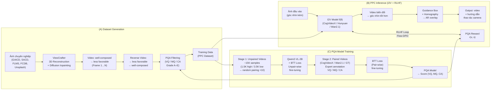

# Pipeline — 001 · Photography Perspective Composition: Towards Aesthetic Perspective Recommendation

> Nguồn: `001_Photography_Perspective_Composition_Towards_Aesthetic_Perspective_Recommendation.pdf` · Worker: pipeline-extract · Ngày: 2026-06-18

---

## Tổng quan luồng (Flow Overview)

Bài báo đề xuất ba pipeline độc lập nhưng liên kết chặt chẽ:

- **(A) Dataset Generation** — Tự động xây dựng tập dữ liệu PPC từ ảnh chuyên nghiệp.
- **(B) PPC Inference** — Sinh video biến đổi góc nhìn từ kém thẩm mỹ sang tốt hơn, kết hợp RLHF/Flow-DPO để căn chỉnh theo sở thích con người.
- **(C) PQA Model Training** — Huấn luyện mô hình đánh giá chất lượng phối cảnh (Perspective Quality Assessment) qua hai giai đoạn so sánh.

---

## Các giai đoạn (Stages)

### Pipeline A — Tự động xây dựng tập dữ liệu PPC (Dataset Generation)

---

#### Stage A1 — Thu thập dữ liệu nguồn (Data Source Collection)

- **Input:** Tập ảnh chuyên nghiệp từ nhiều bộ dữ liệu: GAICD, SACD, FLMS, FCDB, và Unsplash (bộ dữ liệu mã nguồn mở lớn nhất).
- **Operation:** Lựa chọn ảnh có bố cục thẩm mỹ tốt (well-composed perspective) làm điểm xuất phát. Không có phép toán tường minh ở giai đoạn này; tiêu chí lựa chọn dựa vào nguồn gốc dataset chuyên nghiệp.
- **Output:** Tập ảnh đơn $\{I_i\}$ đại diện cho góc nhìn thẩm mỹ tốt (well-composed perspective).

---

#### Stage A2 — Tái tạo 3D và tạo video biến đổi góc nhìn (3D Reconstruction & Perspective Video Generation)

- **Input:** Ảnh đơn $I_i$ (well-composed) + quỹ đạo di chuyển camera (camera motion trajectory) — có thể là ngẫu nhiên.
- **Operation:** Sử dụng **ViewCrafter** [50] để tái tạo đám mây điểm (point cloud) từ ảnh đơn, sau đó render các khung hình tương ứng với quỹ đạo camera. Phần thiếu được lấp đầy bằng **Diffusion Inpainting**. Quá trình sinh video từ frame 1 đến frame N biểu diễn chuyển động từ well-composed sang less-favorable perspective:

  $$V_{\text{gen}} = \text{ViewCrafter}(I_i, \tau_{\text{cam}})$$

  trong đó $\tau_{\text{cam}}$ là quỹ đạo camera (có thể chọn ngẫu nhiên).

- **Output:** Video $V_{\text{gen}} = \{F_1, F_2, \ldots, F_N\}$ chuyển từ well-composed (frame 1) sang less-favorable (frame N).

---

#### Stage A3 — Đảo ngược video (Reverse Video)

- **Input:** Video $V_{\text{gen}} = \{F_1, \ldots, F_N\}$ (well-composed → less-favorable).
- **Operation:** Đảo thứ tự các khung hình:

  $$V_{\text{train}} = \text{Reverse}(V_{\text{gen}}) = \{F_N, F_{N-1}, \ldots, F_1\}$$

  Sau khi đảo, video chuyển từ less-favorable sang well-composed, đúng với dạng dữ liệu huấn luyện mong muốn cho PPC.

- **Output:** Video huấn luyện $V_{\text{train}}$ (less-favorable → well-composed).

---

#### Stage A4 — Lọc dữ liệu bằng PQA (Data Filtering)

- **Input:** Video $V_{\text{train}}$; mô hình PQA đã huấn luyện (từ Pipeline C).
- **Operation:** PQA đánh giá mỗi video theo ba chiều: visual quality (VQ), motion quality (MQ), và composition aesthetic (CA). Điểm tổng hợp (aggregate score) được quy đổi theo thang điểm chuẩn hóa 5 bậc (A–E):

  | Grade | Level | Raw Score Range | Standardized Score |
  |---|---|---|---|
  | A | Excellent | $\geq 5.0$ | 95 (90–100) |
  | B | Good | $0.0$ đến $4.9$ | 85 (80–89) |
  | C | Satisfactory | $-5.0$ đến $-0.1$ | 75 (70–79) |
  | D | Marginal | $-15.0$ đến $-5.1$ | 65 (60–69) |
  | E | Unsatisfactory | $< -15.0$ | 50 ($< 60$) |

  Chỉ giữ lại các mẫu vượt ngưỡng chất lượng (bài báo không nêu rõ ngưỡng cụ thể — not stated in the paper).

- **Output:** Tập dữ liệu PPC đã lọc, sử dụng cho huấn luyện I2V model.

---

### Pipeline B — Suy luận PPC: Sinh video biến đổi góc nhìn (PPC Inference)

---

#### Stage B1 — Sinh video biến đổi góc nhìn (I2V Base Pipeline)

- **Input:** Ảnh đầu vào $s$ (góc nhìn kém thẩm mỹ — less favorable perspective).
- **Operation:** Mô hình image-to-video (I2V) $f(\theta)$ nhận ảnh $s$ và sinh ra video biến đổi góc nhìn. Các backbone được thử nghiệm gồm CogVideoX 1.5 (5B), HunYuan I2V (17B), và Wan2.1 (14B). Quá trình này mô hình hóa phân phối có điều kiện:

  $$v \sim p_\theta(v \mid s)$$

  trong đó $v$ là video output và $s$ là ảnh điều kiện (conditioning image).

- **Output:** Video biến đổi góc nhìn $v$ (less-favorable → well-composed).

---

#### Stage B2 — Tạo hộp hướng dẫn và overlay AR (Guidance Box + Homography)

- **Input:** Frame cuối (last frame) của video $v$ = góc nhìn tốt nhất; ảnh ban đầu $s$.
- **Operation:**
  1. Vẽ **guidance box** (bounding box màu đỏ) trên frame cuối để chỉ vùng đối tượng mục tiêu.
  2. Dùng **feature matching** để chiếu guidance box từ frame cuối sang ảnh gốc $s$, tạo ra hộp bị biến dạng (distorted box).
  3. Khi người dùng di chuyển camera, hộp biến dạng dần tiến về hình chữ nhật khi đạt góc nhìn tốt. Dùng **homography transformation** (biến đổi đồng hình) để đơn giản hóa:

  $$\mathbf{H} = \arg\min_H \sum_i \| \mathbf{x}_i' - H\mathbf{x}_i \|^2$$

  trong đó $\mathbf{x}_i$ là các điểm tương ứng giữa ảnh gốc và frame cuối.

- **Output:** AR overlay hướng dẫn thao tác camera cho người dùng.

---

#### Stage B3 — Căn chỉnh RLHF với Flow-DPO (RLHF Alignment)

- **Input:** Dataset $\mathcal{D} = \{s, v_h, v_l\}$ — mỗi mẫu gồm prompt ảnh $s$, video chất lượng cao $v_h$ (win), và video chất lượng thấp $v_l$ (lose), được tạo bởi reference model $p_{\text{ref}}$.
- **Operation:** Mục tiêu RLHF là học phân phối $p_\theta(v \mid s)$ tối đa hóa reward $r(v, s)$ (từ PQA) trong khi kiểm soát KL-divergence so với $p_{\text{ref}}$ qua hệ số $\beta$:

  $$\max_{p_\theta} \mathbb{E}_{s \sim \mathcal{D},\, v \sim p_\theta(v|s)} \left[ r(v, s) \right] - \beta \, \mathbb{D}_{\text{KL}} \left[ p_\theta(v \mid s) \,\|\, p_{\text{ref}}(v \mid s) \right]$$

  *(phương trình 1 trong paper)*

  Trong Rectified Flow, véc-tơ nhiễu $\xi^*$ liên hệ với trường vận tốc (velocity field) $\nu^*$, trong đó:

  $$\| \xi^* - \xi_{\text{pred}}(\nu_t^*, t) \|^2 = (1-t)^2 \| \nu^* - \nu_{\text{pred}}(\nu_t^*, t) \|^2$$

  với $\xi_{\text{pred}}$ và $\nu_{\text{pred}}$ là dự đoán từ mô hình $p_\theta$ hoặc reference model $p_{\text{ref}}$. Từ quan hệ này, **Flow-DPO loss** $\mathcal{L}_{\text{FD}}(\theta)$ được rút ra:

  $$\mathcal{L}_{\text{FD}}(\theta) = -\mathbb{E}\!\left[\log \sigma\!\left(-\frac{\beta_t}{2}\Bigl(\bigl(\|\nu^h - \nu_\theta(\nu_t^h, t)\|^2 - \|\nu^h - \nu_{\text{ref}}(\nu_t^h, t)\|^2\bigr) - \bigl(\|\nu^l - \nu_\theta(\nu_t^l, t)\|^2 - \|\nu^l - \nu_{\text{ref}}(\nu_t^l, t)\|^2\bigr)\Bigr)\right)\right]$$

  *(phương trình 2 trong paper)*

  trong đó $\beta_t = \beta(1-t)^2$ và kỳ vọng lấy trên các mẫu $\{v_h, v_l\} \sim \mathcal{D}$ và schedule $t$.

- **Output:** Model PPC $f(\theta)$ đã căn chỉnh theo sở thích con người, cho ra video có chất lượng thẩm mỹ cao hơn.

---

### Pipeline C — Huấn luyện mô hình PQA (PQA Model Training)

---

#### Stage C1 — Stage 1: Huấn luyện Unpair-wise (Unpaired Videos)

- **Input:** ~5K video biến đổi góc nhìn được sinh bởi 3D reconstruction; chú thích thủ công xác định ~1.5K mẫu chất lượng cao và ~3.5K mẫu chất lượng thấp. Ghép ngẫu nhiên mỗi mẫu chất lượng cao với 10 mẫu thấp → **15K cặp unpaired**.
- **Operation:** Fine-tune **Qwen2-VL-2B** với **Bradley-Terry model with ties (BTT) loss** [51]. BTT mở rộng Bradley-Terry truyền thống để xử lý trường hợp hòa (tie). Với một cặp video $(v_i, v_j)$:

  $$P(v_i \succ v_j) = \frac{e^{r(v_i)}}{e^{r(v_i)} + e^{r(v_j)}}$$

  $$P(v_i \sim v_j) = \frac{\delta}{e^{r(v_i)} + \delta + e^{r(v_j)}}$$

  trong đó $r(\cdot)$ là reward score và $\delta$ là tham số tie. BTT loss tối thiểu hóa negative log-likelihood trên toàn bộ tập cặp. Token đặc biệt (special tokens) được tách riêng cho VQ (context-agnostic) và CA (composition-aware) để decoupling đặc trưng qua causal attention.

- **Output:** Model PQA trung gian (intermediate), có khả năng phân biệt chất lượng video cơ bản.

---

#### Stage C2 — Stage 2: Huấn luyện Pair-wise (Paired Videos với chú thích chuyên gia)

- **Input:** Các cặp video được sinh từ CogVideoX 1.5, Wan2.1, và GT (ground truth) với cùng ảnh đầu vào. Chú thích chuyên gia theo 3 chiều: VQ, MQ, CA. Mỗi chiều chọn *A wins / Ties / B wins*.
- **Operation:** Tiếp tục fine-tune model từ Stage C1 với BTT loss trên tập paired. Điểm reward cho từng chiều được dự đoán qua **shared linear projection head** áp dụng lên token representation từ layer cuối:

  $$r_d(v) = \mathbf{w}_d^\top \phi_d(v), \quad d \in \{\text{VQ},\ \text{MQ},\ \text{CA}\}$$

  trong đó $\phi_d(v)$ là biểu diễn token tương ứng chiều $d$ từ Qwen2-VL-2B, và $\mathbf{w}_d$ là trọng số projection. Metric CA đặc biệt đánh giá **cải thiện bố cục xuyên suốt video** (compositional improvement throughout the video transformation) — không phải chất lượng từng frame tĩnh.

- **Output:** Model PQA hoàn chỉnh, cho điểm $(r_{\text{VQ}},\ r_{\text{MQ}},\ r_{\text{CA}})$ cho mỗi video đầu vào.

---

## Tiền xử lý & hậu xử lý (Pre/Post-processing)

### Tiền xử lý

- **Lọc artifact (Data Filtering):** Các video được sinh bởi 3D reconstruction thường chứa artifact — distortion (biến dạng), fixedness (đứng hình), và blur (mờ). PQA được dùng để tự động lọc thay cho lọc thủ công (1 người chỉ lọc được ~3K video/ngày).
- **Giới hạn góc xoay (Angle Constraint):** Hệ thống chỉ xử lý các biến đổi góc nhỏ (10°, 20°, 30°). Tập Mix-up (kết hợp mọi góc) cho kết quả tốt nhất trên CMM và FVD.
- **Lấy mẫu video (Video Sampling):** Video được lấy mẫu ở 1 fps với độ phân giải $448 \times 448$ pixels trong quá trình huấn luyện PQA.

### Hậu xử lý

- **Grading chuẩn hóa:** Điểm thô từ PQA được quy đổi sang thang A–E (5 bậc) để tự động hóa lọc dữ liệu.
- **LoRA fine-tuning:** Khi huấn luyện PQA, LoRA [13] được áp dụng để cập nhật toàn bộ linear layers trong language model; vision encoder được fine-tune đầy đủ.
- **Hyperparameters huấn luyện PQA:** Batch size 32, learning rate $2 \times 10^{-6}$, huấn luyện trong 2 epoch trên ~50 NVIDIA H20 GPU hours.

---

## Chỗ thiếu để tái lập (Gaps Blocking Reimplementation)

1. **Ngưỡng lọc PQA không nêu rõ:** Bài báo không công bố ngưỡng điểm cụ thể để giữ/loại mẫu khi lọc dataset (chỉ nói "vượt ngưỡng" — not stated in the paper).

2. **Công thức tổng hợp điểm PQA chưa rõ:** Cách kết hợp ba điểm VQ, MQ, CA thành aggregate score cuối không được định nghĩa tường minh bằng công thức.

3. **Quỹ đạo camera trong ViewCrafter:** Bài báo nói quỹ đạo "có thể là ngẫu nhiên" nhưng không cung cấp chi tiết phân phối hoặc range góc cụ thể sử dụng trong thực tế.

4. **Tie parameter $\delta$ trong BTT loss:** Giá trị của $\delta$ không được công bố.

5. **Số lượng mẫu PPC sau lọc:** Tổng số mẫu còn lại trong training set PPC sau khi lọc PQA không được nêu rõ.

6. **Chi tiết feature matching:** Thuật toán feature matching cụ thể (SIFT, SuperPoint, v.v.) dùng để chiếu guidance box từ frame cuối sang ảnh gốc không được nêu.

7. **Hyperparameters fine-tuning I2V với Flow-DPO:** Learning rate, batch size, số epoch cho I2V fine-tuning không được công bố (bài báo chỉ nêu "follow the settings from the original repository").

---

## Thuật ngữ (Glossary)

| English | Tiếng Việt | Giải thích ngắn |
|---|---|---|
| Photography Perspective Composition (PPC) | Bố cục phối cảnh nhiếp ảnh | Phương pháp bố cục dựa trên biến đổi góc nhìn 3D, khác với cắt xén 2D truyền thống |
| Perspective Quality Assessment (PQA) | Đánh giá chất lượng phối cảnh | Mô hình VLM đánh giá chất lượng video biến đổi góc nhìn theo 3 chiều VQ, MQ, CA |
| Image-to-Video (I2V) | Ảnh-sang-Video | Mô hình sinh video từ một ảnh đầu vào duy nhất |
| ViewCrafter | ViewCrafter | Mô hình tái tạo cảnh 3D và sinh video góc nhìn mới từ ảnh đơn [50] |
| Diffusion Inpainting | Lấp đầy khuếch tán | Kỹ thuật dùng diffusion model để lấp đầy vùng thiếu trong ảnh/video |
| Flow-DPO Loss ($\mathcal{L}_{\text{FD}}$) | Hàm mất mát Flow-DPO | Hàm loss RLHF dựa trên DPO trong không gian Rectified Flow |
| Rectified Flow | Luồng chỉnh lưu | Framework sinh ảnh/video dựa trên ODE với đường thẳng từ nhiễu đến dữ liệu |
| Velocity Field ($\nu^*$) | Trường vận tốc | Đại lượng dự đoán chính trong Rectified Flow, liên hệ với noise vector |
| Bradley-Terry with Ties (BTT) | Mô hình Bradley-Terry có tính hòa | Mô hình xác suất cho học so sánh cặp, mở rộng để xử lý kết quả hòa |
| Direct Preference Optimization (DPO) | Tối ưu hóa sở thích trực tiếp | Phương pháp RLHF tối ưu trực tiếp từ preference data, không cần reward model riêng |
| RLHF | Học tăng cường từ phản hồi người dùng | Kỹ thuật căn chỉnh mô hình AI theo sở thích con người |
| Visual Quality (VQ) | Chất lượng thị giác | Chiều đánh giá chất lượng hình ảnh tổng thể (context-agnostic) |
| Motion Quality (MQ) | Chất lượng chuyển động | Chiều đánh giá sự mượt mà và tự nhiên của chuyển động camera |
| Composition Aesthetic (CA) | Thẩm mỹ bố cục | Chiều đánh giá mức độ cải thiện bố cục thẩm mỹ xuyên suốt video |
| Guidance Box | Hộp hướng dẫn | Bounding box trên frame cuối hướng dẫn người dùng di chuyển camera |
| Homography Transformation | Biến đổi đồng hình | Phép chiếu phẳng ánh xạ điểm giữa hai mặt phẳng |
| Point Cloud | Đám mây điểm | Tập hợp các điểm 3D đại diện cho bề mặt cảnh vật |
| Well-composed Perspective | Góc nhìn bố cục tốt | Góc chụp có bố cục thẩm mỹ tốt, tuân thủ nguyên tắc nhiếp ảnh |
| Less-favorable Perspective | Góc nhìn kém thẩm mỹ | Góc chụp có bố cục chưa tối ưu, là đầu vào cần cải thiện |
| LoRA | Thích nghi hạng thấp | Kỹ thuật fine-tuning hiệu quả bằng cách thêm ma trận hạng thấp vào model |
| Qwen2-VL-2B | Qwen2-VL-2B | Vision-Language Model 2B tham số, backbone cho PQA [40] |
| KL-divergence ($\mathbb{D}_{\text{KL}}$) | Phân kỳ KL | Đo khoảng cách giữa hai phân phối xác suất, dùng làm regularization trong RLHF |
| Causal Attention | Chú ý nhân quả | Cơ chế attention một chiều trong Transformer, dùng để decoupling đặc trưng VQ và CA |
