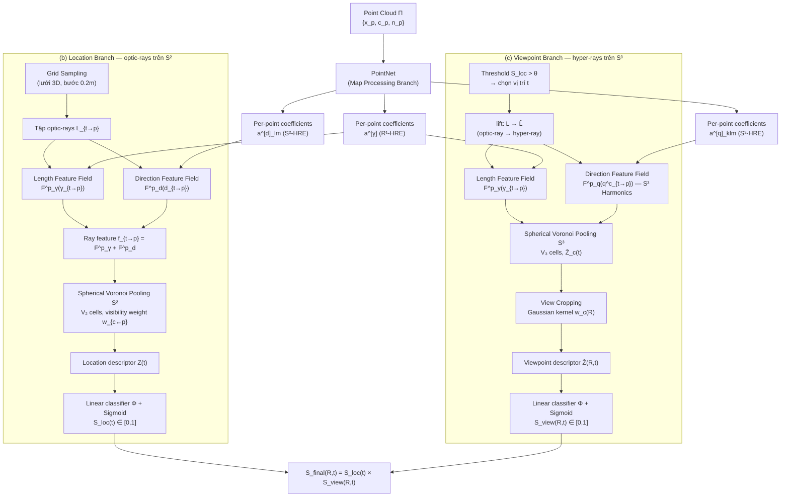

# Pipeline — 003 · Geometric Viewpoint Learning with Hyper-Rays and Harmonics Encoding

> **Paper ID:** 003
> **Tiêu đề:** Geometric Viewpoint Learning with Hyper-Rays and Harmonics Encoding
> **Nguồn:** 003_Geometric_Viewpoint_Learning_with_Hyper-Rays_and_Harmonics_Encoding.pdf
> **Worker:** pipeline-extract
> **Ngày:** 2026-06-18

---

## Tổng quan luồng (Flow overview)

---

## Các giai đoạn (Stages)

### Stage 0 — Map Processing Branch (tiền xử lý điểm mây)

- **Input:** Point cloud (điểm mây) $\Pi = \{\mathbf{x}_p, \mathbf{c}_p, \mathbf{n}_p \in \mathbb{R}^3 \;;\; p = 1\ldots P\}$ — tọa độ 3D, màu sắc, vector pháp tuyến đơn vị của từng điểm.
- **Operation:** PointNet [37] xử lý toàn bộ điểm mây và dự đoán **per-point coefficients** cho ba họ trường đặc trưng (feature fields):
  - Trường hướng trên $\mathbb{S}^2$: hệ số $\mathbf{a}^{[\mathbf{d}]}_{lm} \in \mathbb{R}^D$, dùng cho optic-rays.
  - Trường hướng trên $\mathbb{S}^3$: hệ số $\mathbf{a}^{[\mathbf{q}]}_{klm} \in \mathbb{R}^D$, dùng cho hyper-rays.
  - Trường độ dài trên $\mathbb{R}^1$: hệ số $\mathbf{a}^{[\gamma]} \in \mathbb{R}^D$, dùng chung cho cả hai nhánh.
- **Output:** Ba tập per-point coefficients $\{\mathbf{a}^{[\mathbf{d}]}_{lm}\}$, $\{\mathbf{a}^{[\mathbf{q}]}_{klm}\}$, $\{\mathbf{a}^{[\gamma]}\}$ — lưu trữ song song, dùng làm "bản đồ" tra cứu cho mọi tia sau này.

---

### Stage 1 — Location Branch: Biểu diễn optic-ray và trường đặc trưng

- **Input:** Vị trí ứng viên $\mathbf{t} \in \mathbb{R}^3$; điểm mây $\Pi$; per-point coefficients $\{\mathbf{a}^{[\mathbf{d}]}_{lm}\}$, $\{\mathbf{a}^{[\gamma]}\}$.
- **Operation:**

  **1a. Tạo tập optic-rays** từ $\mathbf{t}$ đến mọi điểm $p$:

  $$\left\{\mathbf{L}_{\mathbf{t}\to p} \mid \mathbf{o}_{\mathbf{t}\to p} = \mathbf{t},\; \mathbf{d}_{\mathbf{t}\to p} = \frac{\mathbf{x}_p - \mathbf{t}}{\|\mathbf{x}_p - \mathbf{t}\|};\; p = 1\ldots P\right\}$$

  *(phương trình 10 trong paper)*

  với $\gamma_{\mathbf{t}\to p} = \|\mathbf{x}_p - \mathbf{t}\|$ là độ dài tia.

  **1b. Length Feature Field** $\mathcal{F}^p_\gamma$ (Fourier series trên $\mathbb{R}^1$):

  $$\mathcal{F}^p_\gamma(\gamma) = \mathbf{a}^{[\gamma]}_0 + \sum_{n=1}^{H_1}\!\left(\mathbf{a}^{[\gamma]}_{2n+1}\cos\!\left(\frac{2\pi\gamma}{\gamma_{max}}n\right) + \mathbf{a}^{[\gamma]}_{2n+2}\sin\!\left(\frac{2\pi\gamma}{\gamma_{max}}n\right)\right)$$

  *(phương trình 9 trong paper)*

  **1c. Direction Feature Field** $\mathcal{F}^p_\mathbf{d}$ (Spherical Harmonics trên $\mathbb{S}^2$):

  $$\mathcal{F}^p_\mathbf{d}(\mathbf{d}) = \sum_{l=0}^{H_2}\sum_{m=-l}^{l} \mathbf{a}^{[\mathbf{d}]}_{lm}\, Y_{lm}(\mathbf{d})$$

  *(phương trình 7 trong paper)*

  trong đó $Y_{lm}(\cdot)$ là đa thức điều hòa cầu (harmonic polynomial) bậc $l$, hạng $m$ trên $\mathbb{S}^2$.

  **1d. Ray feature** kết hợp:

  $$\mathbf{f}_{\mathbf{t}\to p} = \mathcal{F}^p_\gamma(\gamma_{\mathbf{t}\to p}) + \mathcal{F}^p_\mathbf{d}(\mathbf{d}_{\mathbf{t}\to p})$$

  *(phương trình 11 trong paper)*

- **Output:** Tập ray features $\{\mathbf{f}_{\mathbf{t}\to p}\}_{p=1}^{P}$, mỗi phần tử $\in \mathbb{R}^D$.

---

### Stage 2 — Location Branch: Spherical Voronoi Pooling (trên $\mathbb{S}^2$)

- **Input:** Ray features $\{\mathbf{f}_{\mathbf{t}\to p}\}$; hướng tia $\{\mathbf{d}_{\mathbf{t}\to p}\}$.
- **Operation:**

  Tạo $V_2$ cells Voronoi trên $\mathbb{S}^2$ bằng spherical Fibonacci sampling [16], tâm $\{\mathbf{d}_c \mid c=1\ldots V_2\}$.

  **Visibility weight** của điểm $p$ đối với cell $c$:

  $$w_{c\leftarrow p} = \begin{cases} 1 & \text{if } p = \arg\min_{p^* \in \Omega_c} \gamma_{\mathbf{t}\to p^*} \\ 0 & \text{otherwise} \end{cases}$$

  *(phương trình 13 trong paper)*

  trong đó $\Omega_c = \{p \mid c = \arg\max_{c^*}\, \mathbf{d}_{c^*}\cdot\mathbf{d}_{\mathbf{t}\to p}\}$ là tập điểm thuộc cell $c$.

  **Location descriptor**:

  $$\mathbf{Z}(\mathbf{t}) = \frac{1}{V_2}\sum_{c=1}^{V_2}\sum_{p=1}^{P} \frac{w_{c\leftarrow p}}{\sum_{p=1}^{P} w_{c\leftarrow p}}\, \mathbf{f}_{\mathbf{t}\to p}$$

  *(phương trình 12 trong paper)*

- **Output:** Location descriptor $\mathbf{Z}(\mathbf{t}) \in \mathbb{R}^D$ — average-pooled feature của toàn cảnh nhìn từ $\mathbf{t}$.

---

### Stage 3 — Location Branch: Location Score

- **Input:** $\mathbf{Z}(\mathbf{t})$.
- **Operation:**

  $$S_{loc}(\mathbf{t}) = \Phi_{loc}\!\left(\mathbf{Z}(\mathbf{t})\right) \in [0,1]$$

  *(phương trình 14 trong paper)*

  trong đó $\Phi_{loc}(\cdot)$ là linear classifier với sigmoid activation.

- **Output:** Điểm vị trí $S_{loc}(\mathbf{t}) \in [0, 1]$.

---

### Stage 4 — Viewpoint Branch: Lifting optic-ray → hyper-ray

- **Input:** Vị trí $\mathbf{t}$ đã vượt ngưỡng $S_{loc} > \theta$; optic-rays $\mathbf{L}_{\mathbf{t}\to p}$.
- **Operation:**

  **Hyper-ray** (biểu diễn 6DoF đơn nhất):

  $$\hat{\mathbf{L}} \in \mathbb{L}^6 = \left\{\hat{\mathbf{o}} \in \mathbb{R}^3,\; \mathbf{q} \in \mathbb{S}^3\right\}$$

  *(phương trình 3 trong paper)*

  với $\mathbf{q} = (q_w, q_x, q_y, q_z)$, $\|\mathbf{q}\| = 1$ là quaternion đơn vị.

  **Ma trận quay** từ quaternion:

  $$\mathcal{R}(\mathbf{q}) = 2\cdot\begin{bmatrix} q_w^2+q_z^2-0.5 & q_xq_y - q_wq_z & q_wq_y+q_xq_z \\ q_wq_z+q_xq_y & q_w^2+q_y^2-0.5 & q_yq_z-q_wq_x \\ q_xq_z-q_wq_y & q_wq_z+q_yq_z & q_w^2+q_z^2-0.5 \end{bmatrix}$$

  *(phương trình 4 trong paper)*

  **Auxiliary mapping** (collapse: hyper-ray → optic-ray):

  $$aux: \mathbb{L}^6 \to \mathbb{L}^5,\quad aux(\hat{\mathbf{L}}) = \left\{\mathbf{L} \mid \mathbf{o} = \hat{\mathbf{o}},\; \mathbf{d} = \mathcal{R}_3(\mathbf{q})\right\}$$

  *(phương trình 15 trong paper)*

  trong đó $\mathcal{R}_3(\mathbf{q})$ là cột thứ ba của $\mathcal{R}(\mathbf{q})$.

  **Lift function** (optic-ray → tập hyper-rays liên tục):

  $$lift: \mathbb{L}^5 \to \mathbb{L}^6,\quad lift(\mathbf{L}) = \left\{\hat{\mathbf{L}} \mid aux(\hat{\mathbf{L}}) = \mathbf{L}_{\mathbf{t}\to p}\right\}$$

  *(phương trình 16 trong paper)*

- **Output:** Tập hyper-rays $\{lift(\mathbf{L}_{\mathbf{t}\to p})\;;\; p=1\ldots P\}$.

---

### Stage 5 — Viewpoint Branch: Spherical Voronoi Pooling (trên $\mathbb{S}^3$)

- **Input:** Tập hyper-rays $\{lift(\mathbf{L}_{\mathbf{t}\to p})\}$; per-point coefficients $\{\mathbf{a}^{[\mathbf{q}]}_{klm}\}$, $\{\mathbf{a}^{[\gamma]}\}$.
- **Operation:**

  **Direction Feature Field trên $\mathbb{S}^3$** (Harmonics Ray Encoder):

  $$\mathcal{F}^p_\mathbf{q}(\mathbf{q}) = \sum_{k=0}^{H_3}\sum_{l=0}^{k}\sum_{m=-l}^{l} \mathbf{a}^{[\mathbf{q}]}_{klm}\, Y_{klm}(\mathbf{q})$$

  *(phương trình 8 trong paper)*

  Tạo $V_3$ cells Voronoi trên $\mathbb{S}^3$ bằng super-Fibonacci spiral [1], tâm $\{\mathbf{q}_c \mid c = 1\ldots V_3\}$.

  **Hyper-ray direction** đối với cell $c$ — tìm $\mathbf{q}^*$ nhỏ nhất thỏa:

  $$\mathbf{q}^c_{\mathbf{t}\to p} = \arg\min_{\mathbf{q}^*}\angle(\mathbf{q}^*)\quad \text{s.t.}\quad \mathcal{R}_3(\mathbf{q}^* \circ \mathbf{q}_c) = \mathbf{d}_{\mathbf{t}\to p}$$

  *(phương trình 19 trong paper)*

  Nghiệm dạng đóng:

  $$\mathbf{q}^* = \left[\cos\!\left(\frac{|\mathbf{v}|}{2}\right),\; \sin\!\left(\frac{|\mathbf{v}|}{2}\right)\frac{\mathbf{v}}{|\mathbf{v}|}\right]$$

  *(phương trình 20 trong paper)*

  **Cell feature** của Voronoi 3-sphere:

  $$\hat{\mathbf{Z}}_c(\mathbf{t}) = \sum_{p=1}^{P}\frac{w_{c\leftarrow p}}{\sum_{p=1}^{P}w_{c\leftarrow p}}\left(\mathcal{F}^p_\gamma(\gamma_{\mathbf{t}\to p}) + \mathcal{F}^p_\mathbf{q}(\mathbf{q}^c_{\mathbf{t}\to p})\right)$$

  *(phương trình 18 trong paper)*

  với $w_{c\leftarrow p}$ tính theo Eq.(13) được mở rộng sang $\mathbb{S}^3$: $\hat{\Omega}_c = \{p \mid c = \arg\max_{c^*} \mathcal{R}_3(\mathbf{q}_{c^*})\cdot\mathbf{d}_{\mathbf{t}\to p}\}$ (Eq.21).

- **Output:** Voronoi 3-sphere feature: tập $\{\hat{\mathbf{Z}}_c(\mathbf{t})\}_{c=1}^{V_3}$, mỗi cell $\in \mathbb{R}^D$.

---

### Stage 6 — Viewpoint Branch: View Cropping

- **Input:** Voronoi 3-sphere feature $\{\hat{\mathbf{Z}}_c(\mathbf{t})\}$; rotation query $\mathbf{R}$ (pose ứng viên).
- **Operation:**

  **View Cropping** — weighted average với Gaussian kernel trên góc Euler:

  $$\hat{\mathbf{Z}}(\mathbf{R}, \mathbf{t}) = \frac{\sum_{c=1}^{V_3} w_c(\mathbf{R})\,\hat{\mathbf{Z}}_c(\mathbf{t})}{\sum_{c=1}^{V_3} w_c(\mathbf{R})}$$

  *(phương trình 22 trong paper)*

  **Cell weight** — Gaussian kernel trên không gian góc Euler:

  $$w_c(\mathbf{R}) = \exp\!\left(-\mathbf{u}^T\,\mathrm{diag}(\sigma_\phi^2, \sigma_\theta^2, \sigma_\psi^2)^{-1}\,\mathbf{u}\right)$$

  *(phương trình 23 trong paper)*

  trong đó $\mathbf{u} = \left[\angle(\phi, \phi_c),\; \angle(\theta, \theta_c),\; \angle(\psi, \psi_c)\right]^T$ là vector khoảng cách góc (yaw, pitch, roll) giữa rotation query $\mathbf{R}$ và hướng tâm cell $\mathcal{R}(\mathbf{q}_c)$.

  **Sigma** tuyến tính theo FoV camera:

  $$[\sigma_\phi, \sigma_\theta, \sigma_\psi] = \lambda \cdot [\eta_h, \eta_v, \eta_r]$$

  *(phương trình 24 trong paper)*

  trong đó $\eta_h, \eta_v$ là horizontal/vertical FoV, $\eta_r$ là virtual roll-axis FoV, $\lambda$ là hyper-parameter kiểm soát receptive field.

- **Output:** Viewpoint descriptor $\hat{\mathbf{Z}}(\mathbf{R}, \mathbf{t}) \in \mathbb{R}^D$.

---

### Stage 7 — Viewpoint Branch: Viewpoint Score

- **Input:** $\hat{\mathbf{Z}}(\mathbf{R}, \mathbf{t})$.
- **Operation:**

  $$S_{view}(\mathbf{R}, \mathbf{t}) = \Phi_{view}\!\left(\hat{\mathbf{Z}}(\mathbf{R}, \mathbf{t})\right) \in [0, 1]$$

  *(phương trình 25 trong paper)*

  trong đó $\Phi_{view}(\cdot)$ là linear classifier với sigmoid activation.

- **Output:** Điểm viewpoint $S_{view}(\mathbf{R}, \mathbf{t}) \in [0, 1]$.

---

### Stage 8 — Score tổng hợp cuối (Final Score)

- **Input:** $S_{loc}(\mathbf{t})$, $S_{view}(\mathbf{R}, \mathbf{t})$.
- **Operation:**

  $$S_{final}(\mathbf{R}, \mathbf{t}) = S_{loc}(\mathbf{t}) \times S_{view}(\mathbf{R}, \mathbf{t})$$

  *(phương trình 26 trong paper)*

- **Output:** Điểm 6DoF cuối $S_{final} \in [0, 1]$; NMS (Non-Maximum Suppression) áp dụng sau để chọn viewpoints tối ưu.

---

## Tiền xử lý & Hậu xử lý

### Tiền xử lý
- **Point cloud augmentation:** Augment bằng random rotations để tăng tính bất biến quay.
- **Grid sampling vị trí:** Lấy mẫu lưới 3D bước 0.2m trong scene boundary, giữ các vị trí dưới ngưỡng nhỏ (0.01) để tối đa hóa mẫu.
- **Orientation sampling:** 4096 rotations phân bố đều (super-Fibonacci spiral [1]) trên $SO(3)$ cho mỗi vị trí đã vượt ngưỡng.
- **Training batch:** batch size 4; 4 inlier locations × 32 random locations mỗi batch cho location loss; 4 inlier viewpoints với mỗi inlier được thay bằng 8 random sampled rotations cho viewpoint loss.

### Hậu xử lý
- **Thresholding vị trí:** Chỉ giữ $\mathbf{t}$ có $S_{loc}(\mathbf{t}) > 0.8$ trước khi chạy Viewpoint Branch.
- **Non-Maximum Suppression (NMS):** Áp dụng trên $S_{final}$ để trích viewpoints tối ưu cục bộ.
- **Inference speed:** ~8 kHz render S²-sphere feature, ~90 Hz render S³-sphere feature, trên GTX1080Ti; toàn bộ scene ScanNet lấy mẫu trong ~10 giây.

---

## Hàm mất mát (Loss Functions)

**Location loss** (Binary Cross Entropy — BCE):

$$\mathcal{L}_{loc} = -\sum_i \log\!\left(S_{loc}(\mathbf{t}_i^+)\right) - \sum_j \log\!\left(1 - S_{loc}(\mathbf{t}_j^-)\right)$$

*(phương trình 27 trong paper)*

trong đó $\mathbf{t}^+$ là vị trí training (in-sample), $\mathbf{t}^-$ là vị trí lấy ngẫu nhiên trong scene boundary (negative).

**Viewpoint loss** (BCE, chỉ với negative viewpoints có positive locations):

$$\mathcal{L}_{view} = -\sum_i \log\!\left(S_{view}(\mathbf{R}_i^+, \mathbf{t}_i^+)\right) - \sum_j \log\!\left(1 - S_{view}(\mathbf{R}^-, \mathbf{t}_i^+)\right)$$

*(phương trình 28 trong paper)*

trong đó $\mathbf{R}_i^+$ là rotation của training viewpoint tại $\mathbf{t}_i^+$, $\mathbf{R}^-$ là rotation lấy ngẫu nhiên.

---

## Chỗ thiếu để tái lập (Gaps blocking reimplementation)

1. **Công thức tường minh $Y_{klm}(\mathbf{q})$ trên $\mathbb{S}^3$:** Bài báo nhắc "harmonic polynomials whose explicit formulas are included in the appendix" — phụ lục không có trong PDF được cung cấp, đây là điểm nghẽn quan trọng nhất.

2. **Kiến trúc PointNet chi tiết:** Số lớp, kích thước hidden, cách head phân nhánh ra ba họ coefficients không được nêu tường minh.

3. **Số chiều $D$** của feature vectors: Bài báo không nêu $D$ cụ thể.

4. **Giá trị mặc định $H_1, H_2, H_3$** (bậc harmonics tối đa): Chỉ có ablation định tính qua Fig.4(d), không có giá trị số trong phần Method.

5. **Giá trị mặc định $V_2, V_3$** (số cells Voronoi): Chỉ thấy ablation "Sphere Resolution" trong Fig.4(a), không có giá trị mặc định tường minh.

6. **Nghiệm $\mathbf{v}$ trong Eq.(20):** Phụ thuộc vào $\mathcal{R}_3(\mathbf{q}_c) \times \mathbf{d}_{\mathbf{t}\to p}$ — cần xác nhận từ phụ lục.

7. **Code/checkpoint công khai:** Bài báo không đề cập repository — chưa xác nhận.

---

## Thuật ngữ (Glossary)

| English | Tiếng Việt | Giải thích ngắn |
|---|---|---|
| Viewpoint | Điểm nhìn | Pose camera 6DoF $\mathbf{T} = (\mathbf{R}, \mathbf{t}) \in SE(3)$ |
| Optic-ray | Tia quang học | Half-line 5DoF $\mathbf{L} \in \mathbb{L}^5 = \{\mathbf{o}\in\mathbb{R}^3, \mathbf{d}\in\mathbb{S}^2\}$ |
| Hyper-ray | Tia siêu chiều | Half-line 6DoF $\hat{\mathbf{L}} \in \mathbb{L}^6 = \{\hat{\mathbf{o}}\in\mathbb{R}^3, \mathbf{q}\in\mathbb{S}^3\}$; biểu diễn đơn nhất cho $SE(3)$ |
| Harmonics Ray Encoder (HRE) | Bộ mã hóa tia điều hòa | Trường đặc trưng cầu $\mathcal{F}(\cdot)\to\mathbb{R}^D$ dùng spherical harmonics để encode thông tin môi trường dọc tia |
| Spherical Voronoi Pooling | Gộp Voronoi cầu | Phân vùng $\mathbb{S}^2$ hoặc $\mathbb{S}^3$ thành $V$ cells, aggregate ray features theo cell để tạo descriptor đẳng hướng |
| View Cropping | Cắt vùng nhìn | Weighted average của Voronoi 3-sphere feature theo Gaussian kernel FoV để trích descriptor cho một rotation cụ thể |
| Location Branch | Nhánh vị trí | Nhánh thứ nhất dùng optic-rays trên $\mathbb{S}^2$ để tính $S_{loc}(\mathbf{t})$ |
| Viewpoint Branch | Nhánh điểm nhìn | Nhánh thứ hai dùng hyper-rays trên $\mathbb{S}^3$ để tính $S_{view}(\mathbf{R},\mathbf{t})$ |
| Point cloud | Điểm mây | Tập hợp điểm 3D $\Pi = \{\mathbf{x}_p, \mathbf{c}_p, \mathbf{n}_p\}$ biểu diễn cảnh 3D |
| PointNet | PointNet | Kiến trúc học sâu xử lý trực tiếp điểm mây [37] |
| Spherical Fibonacci sampling | Lấy mẫu Fibonacci cầu | Phương pháp phân bố đều $V_2$ điểm trên $\mathbb{S}^2$ [16] |
| Super-Fibonacci spiral | Xoắn ốc Fibonacci siêu chiều | Phương pháp phân bố đều $V_3$ điểm trên $\mathbb{S}^3$ [1] |
| Binary Cross Entropy (BCE) | Entropy chéo nhị phân | Hàm mất mát phân loại nhị phân in-sample/out-of-sample |
| Non-Maximum Suppression (NMS) | Triệt phi cực đại | Hậu xử lý chọn viewpoints tối ưu cục bộ từ tập điểm dày |
| SE(3) | SE(3) | Nhóm biến đổi Euclidean đặc biệt — rotation $SO(3)$ + translation $\mathbb{R}^3$, mô tả đầy đủ pose 6DoF |
| DoF (Degrees of Freedom) | Bậc tự do | Số chiều độc lập trong không gian pose camera |
| FoV (Field of View) | Góc nhìn | Góc nhìn ngang/dọc camera, dùng xác định sigma trong View Cropping |
| ScanNet | ScanNet | Dataset RGB-D trong nhà: 1513 cảnh quét, 707 môi trường [7] |
| Quaternion | Quaternion | Số bốn chiều $\mathbf{q}=(q_w,q_x,q_y,q_z)$, $\|\mathbf{q}\|=1$, dùng biểu diễn rotation 3D |
| Spherical harmonics | Hàm điều hòa cầu | Tập hàm cơ sở trực giao trên $\mathbb{S}^2$ (hoặc $\mathbb{S}^3$), dùng encode thông tin hướng |
