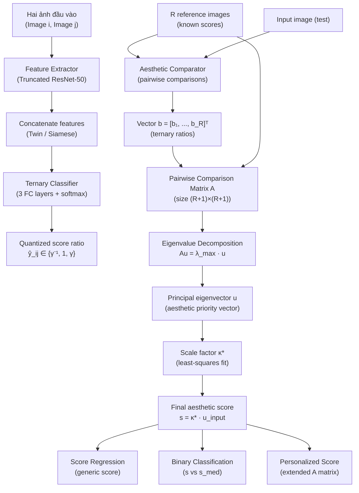

# Pipeline — 004 · Image Aesthetic Assessment Based on Pairwise Comparison

> **Paper ID:** 004
> **Tiêu đề gốc:** Image Aesthetic Assessment Based on Pairwise Comparison – A Unified Approach to Score Regression, Binary Classification, and Personalization
> **Nguồn:** `004_Image_Aesthetic_Assessment_Based_on_Pairwise_Comparison.pdf`
> **Worker:** pipeline-extract
> **Ngày:** 2026-06-18

---

## Tổng quan luồng (Flow Overview)

---

## Các giai đoạn (Stages)

### Stage 1 — Feature Extraction (Trích xuất đặc trưng)

- **Input:** Một cặp ảnh $(i, j)$ — ảnh đầu vào cần đánh giá và ảnh tham chiếu (reference image).
- **Operation:**
  Mạng baseline là ResNet-50 được dùng như bộ phân loại nhị phân (binary aesthetic classifier) để tiền huấn luyện (pretrain). Mạng này sử dụng 5 nhóm residual block (res1 ∼ res5). Để trích xuất đặc trưng đa tỉ lệ, 4 local residual block (res5-$k$, $1 \le k \le 4$) được thêm song song với res5, mỗi block phân tích một góc phần tư (quadrant) của output res4.

  Output của res5 và res5-1, ..., res5-4 được **average-pooled** rồi **concatenate** thành vector đặc trưng tổng hợp. Mạng được cắt ngắn (truncated) trước lớp fc2, output của mỗi nhánh là một vector đặc trưng $\mathbf{f}_i$ và $\mathbf{f}_j$.

- **Output:** Hai vector đặc trưng $\mathbf{f}_i$, $\mathbf{f}_j$ (local + global aesthetic features).

---

### Stage 2 — Aesthetic Comparator / Ternary Classification (So sánh thẩm mỹ / Phân loại tam phân)

- **Input:** Hai vector đặc trưng $\mathbf{f}_i$, $\mathbf{f}_j$ từ Stage 1 (Siamese network — shared weights).
- **Operation:**
  Hai vector được **concatenate** rồi truyền qua 3 lớp fully connected và một lớp $\text{softmax}$ để phân loại thành 3 lớp (ternary classification). Mạng ước lượng tỉ lệ điểm thẩm mỹ (score ratio) liên tục $r_{ij} = s_i / s_j$, sau đó lượng tử hóa (quantize) thành một trong ba nhãn:

  $$
  \hat{r}_{ij} = \begin{cases}
    \gamma & \theta \le r_{ij} \\
    1 & \theta^{-1} \le r_{ij} < \theta \\
    \gamma^{-1} & r_{ij} < \theta^{-1}
  \end{cases}
  $$

  *(phương trình 1 trong paper)*

  trong đó $\gamma > 1$ là mức tái tạo (reconstruction level) cho lớp "vượt trội", $\theta$ là ngưỡng quyết định (decision level). Hai tham số $\gamma$ và $\theta$ được xác định bằng cách chỉnh sửa thuật toán Lloyd để thỏa ràng buộc đối xứng nghịch đảo (reciprocal constraint).

  Mức tái tạo $\gamma$ được tính bằng:

  $$\gamma = \frac{\int_{\theta}^{\infty} r \, p(r) \, dr}{\int_{\theta}^{\infty} p(r) \, dr}$$

  *(phương trình 2 trong paper)*

  trong đó $p(r)$ là phân phối xác suất của các tỉ lệ điểm (score ratios) trong tập huấn luyện. Ngưỡng $\theta$ được đặt bằng điểm giữa $\frac{1+\gamma}{2}$ theo tiêu chí nearest-neighbor. Hai bước này lặp lại cho đến hội tụ.

  Hàm mất mát huấn luyện là cross-entropy:

  $$L_c(\mathbf{p}, \bar{\mathbf{p}}) = -\sum_{k=0}^{2} \bar{p}_k \log p_k$$

  *(phương trình CE trong paper)*
  trong đó $\mathbf{p} = (p_0, p_1, p_2)$ là xác suất ước lượng và $\bar{\mathbf{p}} = (\bar{p}_0, \bar{p}_1, \bar{p}_2)$ là nhãn ground-truth.

- **Output:** Giá trị tỉ lệ lượng tử hóa $\hat{r}_{ij} \in \{\gamma^{-1}, 1, \gamma\}$ cho mỗi cặp ảnh.

---

### Stage 3 — Pairwise Comparison Matrix Construction (Xây dựng ma trận so sánh cặp đôi)

- **Input:** $R$ ảnh tham chiếu (reference images) có điểm thẩm mỹ đã biết $a_1, \ldots, a_R$; vector $\mathbf{b} = [b_1, b_2, \ldots, b_R]^\top$ gồm các tỉ lệ lượng tử hóa giữa từng ảnh tham chiếu $i$ và ảnh đầu vào (output của Stage 2).
- **Operation:**
  **Bước 3a:** Xây dựng ma trận $\mathbf{A}_{\text{ref}}$ kích thước $R \times R$ cho các ảnh tham chiếu với nhau, trong đó phần tử $(i,j)$ là tỉ lệ điểm thực:

  $$\mathbf{A}_{\text{ref}} = \begin{bmatrix} a_1/a_1 & a_1/a_2 & \cdots & a_1/a_R \\ a_2/a_1 & a_2/a_2 & \cdots & a_2/a_R \\ \vdots & \vdots & & \vdots \\ a_R/a_1 & a_R/a_2 & \cdots & a_R/a_R \end{bmatrix}$$

  *(phương trình 3 trong paper)*

  **Bước 3b:** Kết hợp $\mathbf{A}_{\text{ref}}$ với vector $\mathbf{b}$ để tạo ma trận pairwise comparison $\mathbf{A}$ kích thước $(R+1) \times (R+1)$ cho cả ảnh tham chiếu và ảnh đầu vào:

  $$\mathbf{A} = \begin{bmatrix} \mathbf{A}_{\text{ref}} & \mathbf{b} \\ \bar{\mathbf{b}}^\top & 1 \end{bmatrix}$$

  *(phương trình 4 trong paper)*

  trong đó $\bar{\mathbf{b}} = [b_1^{-1}, b_2^{-1}, \ldots, b_R^{-1}]^\top$ là nghịch đảo phần tử của $\mathbf{b}$, đảm bảo tính đối xứng nghịch đảo (reciprocal symmetry) của $\mathbf{A}$.

  **Lưu ý:** $\mathbf{A}$ là một reciprocal matrix (ma trận đối xứng nghịch đảo) với mọi phần tử dương, đảm bảo điều kiện áp dụng định lý Perron-Frobenius.

- **Output:** Ma trận $\mathbf{A}$ kích thước $(R+1) \times (R+1)$ (reciprocal, positive).

---

### Stage 4 — Eigenvalue Decomposition (Phân rã trị riêng)

- **Input:** Ma trận pairwise comparison $\mathbf{A}$ kích thước $(R+1) \times (R+1)$ từ Stage 3.
- **Operation:**
  Theo phương pháp scaling của Saaty [35], priority vector (vector ưu tiên) của các điểm thẩm mỹ được tìm bằng cách giải bài toán trị riêng (eigenvalue problem):

  $$\mathbf{A}\mathbf{u} = \lambda \mathbf{u}$$

  *(phương trình 5 trong paper)*

  Theo định lý Perron-Frobenius [14], $\mathbf{A}$ có một trị riêng dương lớn nhất $\lambda_{\max} = R + 1$ (trong trường hợp lý tưởng không có lỗi) với vector riêng tương ứng (principal eigenvector) có tất cả các phần tử không âm. Vector riêng chính này được ký hiệu là:

  $$\mathbf{u} = [\mathbf{u}_{\text{ref}}^\top, u]^\top$$

  trong đó $\mathbf{u}_{\text{ref}}$ là vector ưu tiên cho $R$ ảnh tham chiếu, $u$ là priority (ưu tiên) của ảnh đầu vào. Trong thực tế, các tỉ lệ trong $\mathbf{b}$ chứa lỗi phân loại và lượng tử hóa nên $\lambda_{\max}$ chỉ là trị riêng có mô-đun lớn nhất (không nhất thiết bằng $R+1$).

- **Output:** Principal eigenvector $\mathbf{u} = [\mathbf{u}_{\text{ref}}^\top, u]^\top$ (aesthetic priority vector).

---

### Stage 5 — Score Calibration via Scale Factor (Hiệu chỉnh điểm qua hệ số tỉ lệ)

- **Input:** Principal eigenvector $\mathbf{u}$ từ Stage 4; ground-truth score vector $\tilde{\mathbf{s}}_{\text{ref}}$ của $R$ ảnh tham chiếu.
- **Operation:**
  Score vector $\mathbf{s}$ được tái tạo từ eigenvector $\mathbf{u}$ qua một hệ số tỉ lệ vô hướng (scalar scale factor) $\kappa$:

  $$\mathbf{s} = \kappa \mathbf{u}$$

  *(phương trình 6 trong paper)*

  Hệ số tối ưu $\kappa^*$ được xác định bằng cách tối thiểu hóa sai số bình phương $\|\tilde{\mathbf{s}}_{\text{ref}} - \mathbf{s}_{\text{ref}}\|^2 = \|\tilde{\mathbf{s}}_{\text{ref}} - \kappa\mathbf{u}_{\text{ref}}\|^2$, cho nghiệm dạng closed-form:

  $$\kappa^* = \frac{\mathbf{u}_{\text{ref}}^\top \tilde{\mathbf{s}}_{\text{ref}}}{\mathbf{u}_{\text{ref}}^\top \mathbf{u}_{\text{ref}}}$$

  *(phương trình 7 trong paper)*

  Cuối cùng, điểm thẩm mỹ của ảnh đầu vào được tính bằng:

  $$s = \kappa^* u$$

  *(phương trình 8 trong paper)*

- **Output:** Điểm thẩm mỹ vô hướng $s \in \mathbb{R}^+$ cho ảnh đầu vào.

---

### Stage 6 (Biến thể) — Binary Classification (Phân loại nhị phân thẩm mỹ)

- **Input:** Điểm $s$ từ Stage 5; ngưỡng trung vị $s_{\text{med}}$ trên tập huấn luyện.
- **Operation:**
  Sử dụng $R = 30$ ảnh tham chiếu có điểm gần với điểm trung vị nhất (thay vì phân phối đều). Toàn bộ pipeline giống Stages 1–5, nhưng ma trận $\mathbf{A}_{\text{ref}}$ (Stage 3) có các phần tử gần bằng 1 (do điểm tham chiếu tương tự nhau). Quyết định phân loại:

  $$
  \text{class} = \begin{cases}
    \text{high quality} & s > s_{\text{med}} \\
    \text{low quality} & s \le s_{\text{med}}
  \end{cases}
  $$

  Độ chính xác đo bằng:

  $$\text{Accuracy} = \frac{N_c}{N}$$

  *(phương trình 13 trong paper)*

  trong đó $N_c$ là số ảnh phân loại đúng, $N$ là tổng số ảnh kiểm tra.

- **Output:** Nhãn nhị phân (high quality / low quality).

---

### Stage 7 (Biến thể) — Personalized Score Regression (Hồi quy điểm cá nhân hóa)

- **Input:** $R_g$ generic reference images (điểm được đánh giá bởi hàng trăm annotator); $R_p$ personal reference images (điểm do một người dùng đơn lẻ đánh giá); ảnh đầu vào cần đánh giá cá nhân hóa. Điều kiện: $R_g \ge R_p$.
- **Operation:**
  Xây dựng ma trận pairwise comparison mở rộng kích thước $(R_g + R_p + 1) \times (R_g + R_p + 1)$:

  $$\mathbf{A} = \begin{bmatrix} \mathbf{A}_g & \mathbf{A}_{gp} & \mathbf{b}_g \\ \mathbf{A}_{gp}^\top & \mathbf{A}_p & \mathbf{b}_p \\ \mathbf{b}_g^\top & \mathbf{b}_p^\top & 1 \end{bmatrix}$$

  *(phương trình 9 trong paper)*

  trong đó $\mathbf{A}_g$, $\mathbf{A}_p$ là ma trận so sánh cho generic và personal reference images; $\mathbf{A}_{gp}$ ghi nhận tỉ lệ điểm giữa từng cặp (generic, personal); $\mathbf{b}_g$, $\mathbf{b}_p$ là vector tỉ lệ của ảnh đầu vào so với từng loại ảnh tham chiếu.

  Sau phân rã trị riêng của $\mathbf{A}$ trong (9), thu được $\mathbf{u} = [\mathbf{u}_g^\top, \mathbf{u}_p^\top, u]^\top$. Điểm cá nhân hóa được tính bằng:

  $$s = \frac{\mathbf{u}_g^\top \tilde{\mathbf{s}}_g + \mathbf{u}_p^\top \tilde{\mathbf{s}}_p}{\mathbf{u}_g^\top \mathbf{u}_g + \mathbf{u}_p^\top \mathbf{u}_p} \cdot u$$

  *(phương trình 10 trong paper)*

  trong đó $\tilde{\mathbf{s}}_g$ và $\tilde{\mathbf{s}}_p$ là ground-truth score vector của generic và personal reference images.

- **Output:** Điểm thẩm mỹ cá nhân hóa (personalized aesthetic score) $s \in \mathbb{R}^+$.

---

## Tiền xử lý & Hậu xử lý

### Tiền xử lý (Pre-processing)

| Bước | Mô tả |
|------|-------|
| Chọn reference images | Khởi tạo $R_{\text{init}} = 200$ ảnh tham chiếu từ tập huấn luyện, chia thành 10 partition đều nhau, lấy ngẫu nhiên $0.1 R_{\text{init}}$ ảnh từ mỗi partition để đảm bảo phân phối điểm đều |
| Lọc reference images | Dùng aesthetic comparator đánh giá độ chính xác pairwise với validation set; loại bỏ 5 ảnh kém tin cậy nhất mỗi bước cho đến khi còn $R$ ảnh (VD: $R = 110$ với AVA dataset) |
| Trích xuất feature tham chiếu trước | CNN feature của ảnh tham chiếu được trích xuất offline để tăng tốc inference — tránh tái trích xuất mỗi lần test |
| Xác định $\gamma$, $\theta$ | Chạy thuật toán Lloyd cải tiến trên phân phối $p(r)$ của tập huấn luyện, lặp đến hội tụ |

### Hậu xử lý (Post-processing)

| Bước | Mô tả |
|------|-------|
| Normalization (MASD) | Điểm $s$ và $\tilde{s}$ được chuẩn hóa về $[0, 1]$ trước khi tính MASD |
| Spearman's coefficient | Xếp hạng (rank) các điểm hồi quy để tính $\rho = 1 - \dfrac{6\sum_i(r_i - \hat{r}_i)^2}{N^3 - N}$ (Eq. 11) |

---

## Chỗ thiếu để tái lập (Reproducibility Gaps)

| # | Thông tin còn thiếu | Mức độ ảnh hưởng |
|---|---------------------|-----------------|
| 1 | Kiến trúc chi tiết 3 FC layers trong ternary classifier (số units, dropout, batch normalization) | Cao — ảnh hưởng trực tiếp đến accuracy của comparator |
| 2 | Phân phối cụ thể $p(r)$ dùng để tính $\gamma$, $\theta$ và số vòng lặp Lloyd hội tụ thực tế | Trung bình — $\gamma$, $\theta$ khác nhau giữa dataset |
| 3 | Cách tính $\mathbf{A}_{gp}$ trong Eq. (9): dùng aesthetic comparator hay tỉ lệ điểm thực? | Trung bình — ảnh hưởng đến personalization pipeline |
| 4 | Hyperparameter huấn luyện (learning rate, batch size, số epoch, optimizer) cho Siamese network | Trung bình — ảnh hưởng đến chất lượng feature |
| 5 | Cách xác định $s_{\text{med}}$ cho binary classification khi không biết test score distribution | Thấp — với AVA: $s_{\text{med}} = 5$ đã được nêu rõ |
| 6 | Code nguồn / checkpoint công khai | bài báo không nêu (not stated in the paper) — Cao, không có baseline để verify |

---

## Thuật ngữ (Glossary)

| English | Tiếng Việt | Giải thích ngắn |
|---------|-----------|----------------|
| Aesthetic comparator | Bộ so sánh thẩm mỹ | Mạng Siamese ước lượng tỉ lệ điểm thẩm mỹ giữa hai ảnh |
| Siamese network | Mạng Siamese | Kiến trúc với hai nhánh chia sẻ trọng số, xử lý cặp đầu vào |
| Ternary classifier | Bộ phân loại tam phân | Phân loại vào 3 lớp: superior / similar / inferior |
| Score ratio | Tỉ lệ điểm thẩm mỹ | $r_{ij} = s_i/s_j$ — tỉ số điểm giữa ảnh $i$ và ảnh $j$ |
| Ternary quantization | Lượng tử hóa tam phân | Rời rạc hóa tỉ lệ liên tục thành $\{\gamma^{-1}, 1, \gamma\}$ |
| Reconstruction level | Mức tái tạo | Giá trị $\gamma$ đại diện cho nhãn "superior" |
| Decision level | Ngưỡng quyết định | Giá trị $\theta$ phân tách "similar" và "superior" |
| Pairwise comparison matrix | Ma trận so sánh cặp đôi | Ma trận $\mathbf{A}$ kích thước $(R+1)\times(R+1)$ chứa các tỉ lệ điểm |
| Reciprocal matrix | Ma trận đối xứng nghịch đảo | Ma trận $\mathbf{A}$ thỏa $a_{ij} = 1/a_{ji}$ với mọi $i,j$ |
| Eigenvalue decomposition | Phân rã trị riêng | Tìm $\lambda_{\max}$ và eigenvector tương ứng của $\mathbf{A}$ |
| Principal eigenvector | Vector riêng chính | Eigenvector ứng với $\lambda_{\max}$, dùng làm priority vector |
| Priority vector | Vector ưu tiên | Vector $\mathbf{u}$ biểu diễn thứ tự ưu tiên thẩm mỹ tương đối |
| Scale factor | Hệ số tỉ lệ | Giá trị vô hướng $\kappa^*$ dùng để ánh xạ priority vector về điểm tuyệt đối |
| Perron-Frobenius theorem | Định lý Perron-Frobenius | Đảm bảo ma trận dương có trị riêng lớn nhất duy nhất với eigenvector dương |
| Score regression | Hồi quy điểm thẩm mỹ | Dự đoán điểm thẩm mỹ liên tục (generic) |
| Binary aesthetic classification | Phân loại thẩm mỹ nhị phân | Phân loại ảnh thành high quality / low quality |
| Personalized aesthetics | Thẩm mỹ cá nhân hóa | Điều chỉnh điểm theo sở thích cá nhân người dùng |
| Reference image | Ảnh tham chiếu | Ảnh đã biết điểm thẩm mỹ, dùng để xây dựng ma trận $\mathbf{A}$ |
| Generic reference image | Ảnh tham chiếu tổng quát | Ảnh được đánh giá bởi nhiều annotator, đại diện cho gu thẩm mỹ chung |
| Personal reference image | Ảnh tham chiếu cá nhân | Ảnh được đánh giá bởi một người dùng cụ thể |
| Saaty's scaling method | Phương pháp tỉ lệ Saaty | Phương pháp tái tạo độ ưu tiên tuyệt đối từ so sánh cặp đôi tương đối |
| Lloyd algorithm | Thuật toán Lloyd | Thuật toán lượng tử hóa vô hướng, ở đây sửa đổi để tìm $\gamma$, $\theta$ |
| MASD | Sai số tuyệt đối trung bình | Mean of Absolute Score Differences: $\frac{1}{N}\sum_i |s_i - \hat{s}_i|$ |
| Spearman's coefficient ($\rho$) | Hệ số tương quan hạng Spearman | Đo tương quan hạng giữa điểm hồi quy và ground truth |
| AVA dataset | Bộ dữ liệu AVA | ~250.000 ảnh với điểm thẩm mỹ từ ~200 annotator mỗi ảnh |
| AADB dataset | Bộ dữ liệu AADB | 10.000 ảnh với điểm thẩm mỹ và confidence scores từ 5 annotator |
| FLICKER-AES dataset | Bộ dữ liệu FLICKER-AES | ~40.000 ảnh cho đánh giá thẩm mỹ cá nhân hóa, 210 workers |
| Cross-entropy loss | Hàm mất mát cross-entropy | $L_c(\mathbf{p},\bar{\mathbf{p}}) = -\sum_k \bar{p}_k \log p_k$ — dùng huấn luyện ternary classifier |
| Truncated ResNet-50 | ResNet-50 cắt ngắn | ResNet-50 được bỏ lớp fc2 trở đi, dùng làm feature extractor |
| res5-k blocks | Khối res5-k | Bốn local residual block bổ sung song song với res5, phân tích local features từng góc phần tư |
