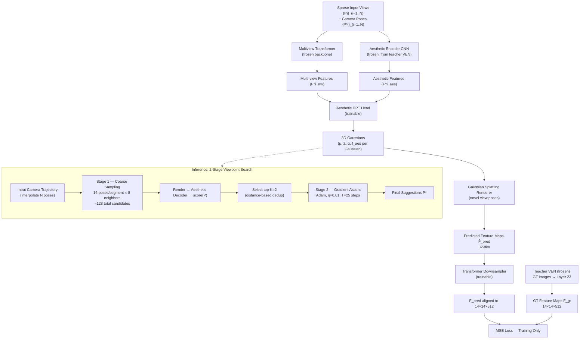

# Pipeline — 008 · Aesthetic Camera Viewpoint Suggestion with 3D Aesthetic Field

> **Paper ID:** 008
> **Tiêu đề:** Aesthetic Camera Viewpoint Suggestion with 3D Aesthetic Field
> **Nguồn:** `008_Aesthetic_Camera_Viewpoint_Suggestion_with_3D_Aesthetic_Field.pdf`
> **Worker:** pipeline-extract
> **Ngày:** 2026-06-18

---

## Tổng quan luồng (Flow Overview)

---

## Các giai đoạn (Stages)

### Stage 0 — Feedforward 3DGS Backbone (frozen)

- **Input:** Tập ảnh thưa $\{\mathbf{I}^i \in \mathbb{R}^{H \times W \times 3}\}_{i=1}^{N}$ và pose camera $\{\mathbf{P}^i \in \mathbb{R}^{3 \times 4}\}_{i=1}^{N}$, với $N \in \{2, 4, 6\}$.
- **Operation:** Multiview Transformer tổng hợp đặc trưng qua cơ chế plane-sweep aggregation và monocular depth cues, tạo ra $\{\mathbf{F}^i_{mv}\}_{i=1}^N$. DPT head geometry hồi quy các tham số Gaussian per-pixel: tâm $\pmb{\mu}$, hiệp phương sai $\pmb{\Sigma}$, độ mờ $\alpha$, màu sắc $c$. Toàn bộ backbone này được **giữ nguyên (frozen)** trong quá trình học 3D Aesthetic Field.
- **Output:** Tập hợp 3D Gaussians biểu diễn hình học và màu sắc của cảnh.

---

### Stage 1 — Học 3D Aesthetic Field (Training)

#### Stage 1a — Aesthetic Encoder (frozen)

- **Input:** Ảnh đầu vào $\{\mathbf{I}^i\}_{i=1}^N$.
- **Operation:** CNN Aesthetic Encoder (trích từ lớp feature extraction của teacher VEN [29]) tạo đặc trưng thẩm mỹ đa tỉ lệ $\{\mathbf{F}^i_{aes}\}_{i=1}^N$. Module này được giữ frozen.
- **Output:** Multi-scale aesthetic features $\{\mathbf{F}^i_{aes}\}_{i=1}^N$.

#### Stage 1b — Aesthetic DPT Head (trainable)

- **Input:** $\{\mathbf{F}^i_{mv}\}_{i=1}^N$ từ backbone, $\{\mathbf{F}^i_{aes}\}_{i=1}^N$ từ encoder, và input view poses $\{\mathbf{P}^i\}$ (view-conditioning).
- **Operation:** Aesthetic DPT Head hồi quy per-Gaussian aesthetic embedding $\mathbf{f}_{aes} \in \mathbb{R}^{32}$ (compact 32-dim thay vì 512-dim của teacher để giảm storage và rendering overhead). Pose conditioning được tích hợp nhằm nắm bắt tính phụ thuộc góc nhìn (viewpoint-dependence) của thẩm mỹ.
- **Output:** Mỗi Gaussian mang thêm thuộc tính $\mathbf{f}_{aes}$, hình thành **3D Aesthetic Field**.

#### Stage 1c — Gaussian Splatting Render + Transformer Downsampler (trainable)

- **Input:** 3D Gaussians $(\pmb{\mu}, \pmb{\Sigma}, \alpha, \mathbf{f}_{aes})$ cùng novel view poses.
- **Operation:** Kết xuất (render) aesthetic features sang góc nhìn mới qua cùng pipeline Gaussian Splatting với RGB rendering, tạo $\hat{\mathbf{F}}_{pred} \in \mathbb{R}^{H' \times W' \times 32}$. Do $\hat{\mathbf{F}}_{pred}$ có kích thước nhỏ hơn và chiều sâu kênh khác với $\mathbf{F}_{gt}$ của teacher, một **Transformer Downsampler** nhẹ được dùng để căn chỉnh:

$$\hat{\mathbf{F}}_{pred} \longrightarrow \mathbf{F}_{pred} \in \mathbb{R}^{14 \times 14 \times 512} \quad \text{(Transformer Downsampler)}$$

- **Output:** Predicted feature maps $\mathbf{F}_{pred}$ cùng kích thước với $\mathbf{F}_{gt}$.

#### Stage 1d — MSE Distillation Loss

- **Input:** $\mathbf{F}_{pred}$ (dự đoán) và $\mathbf{F}_{gt}$ (ground-truth từ teacher VEN tại layer $23^{\text{rd}}$, kích thước $14 \times 14 \times 512$).
- **Operation:** Hàm mục tiêu huấn luyện là MSE loss trên rendered feature maps:

$$\mathcal{L}_{\text{distill}} = \left\| \mathbf{F}_{pred} - \mathbf{F}_{gt} \right\|_2^2$$

Trong đó $\mathbf{F}_{gt}$ thu được bằng cách đưa ảnh ground-truth qua teacher VEN (frozen). Chỉ Aesthetic DPT Head và Transformer Downsampler được cập nhật; tất cả modules còn lại frozen.

- **Output:** Gradient cập nhật hai module trainable; 3D Aesthetic Field hội tụ, có khả năng dự đoán aesthetic embedding tại góc nhìn tùy ý.

---

### Stage 2 — Viewpoint Search: Coarse Sampling (Inference)

- **Input:** Input view poses $\{\mathbf{P}^i\}_{i=1}^N$; 3D Aesthetic Field đã huấn luyện.
- **Operation:**
  1. Nội suy cả vị trí lẫn hướng camera để tạo **camera trajectory** liên tục trơn, bao phủ các input viewpoints.
  2. Chia trajectory thành các đoạn; trong mỗi đoạn lấy mẫu đều **16 camera poses**.
  3. Quanh mỗi pose, sinh thêm **8 poses lân cận** (small in-plane shifts + directional jitters) để khám phá cục bộ, tổng cộng $\approx 128$ candidates.
  4. Render aesthetic features tại mỗi candidate qua 3D Aesthetic Field, đưa qua Aesthetic Decoder để tính $score(\mathbf{P})$.
  5. Chọn **top-$K = 2$** candidates; áp dụng **distance-based deduplication** để lọc các candidates quá gần nhau, đảm bảo đa dạng.

- **Output:** $\{\mathbf{P}^k_{cand}\}_{k=1}^{K=2}$ — tập viewpoint candidates chất lượng cao và đa dạng.

---

### Stage 3 — Viewpoint Search: Gradient-based Refinement (Inference)

- **Input:** $\{\mathbf{P}^k_{cand}\}_{k=1}^{K}$ từ Stage 2.
- **Operation:** Gradient ascent trực tiếp trên pose camera để cực đại hóa aesthetic score. Bài toán tối ưu:

$$\mathbf{P}^* = \arg\max_{\mathbf{P}}\; score(\mathbf{P})$$

*(phương trình 1 trong paper)*

Quy tắc cập nhật tại mỗi bước:

$$\mathbf{P}_{t+1} = \mathbf{P}_t + \eta \nabla_{\mathbf{P}}\, score(\mathbf{P}_t)$$

*(phương trình 2 trong paper)*

Cấu hình cụ thể:
- Optimizer: **Adam** [10]
- Step size: $\eta = 0.01$
- Số bước: $T = 25$
- Không gian tối ưu: vector **5 chiều** = 3D translation + yaw + pitch (roll không tối ưu vì hiếm được điều chỉnh trong chụp ảnh thực tế)

Gradient được tính qua differentiable Gaussian Splatting renderer → Aesthetic Decoder → scalar score, sau đó backprop về $\mathbf{P}_t$.

- **Output:** Các viewpoints tinh chỉnh $\{\mathbf{P}^*_k\}_{k=1}^K$ — **kết quả gợi ý cuối cùng**.

---

## Tiền xử lý & hậu xử lý

### Tiền xử lý (Preprocessing)
- **Độ phân giải ảnh:** $256 \times 256$ cho RE10k; $256 \times 448$ cho DL3DV.
- **Số input views:** $N \in \{2, 4, 6\}$; trong training RE10k luôn sample $N=2$, DL3DV sample $N=2$ đến $6$.
- **Camera poses:** Lấy trực tiếp từ metadata dataset (RE10k, DL3DV đều có poses sẵn); trong thực tế có thể dùng COLMAP.
- **Teacher features:** Feed ground-truth images qua VEN [29] (frozen), trích từ layer $23^{\text{rd}}$, kích thước $14 \times 14 \times 512$.

### Hậu xử lý (Postprocessing)
- **Diversity filter:** Sau coarse sampling, áp dụng distance-based deduplication để loại bỏ candidates quá gần nhau trước khi vào refinement.
- **Top-K selection:** Sau refinement, chọn top-scoring viewpoints làm suggestions cuối cùng ($K=2$ trong ablation tối ưu).
- **Evaluation (inference time):** Tái tạo cảnh với dense inputs để lấy pseudo ground-truth ảnh tại suggested viewpoints — chỉ phục vụ đánh giá, không nằm trong pipeline gợi ý.

---

## Chỗ thiếu để tái lập (Reproducibility Gaps)

| Mục | Trạng thái | Ghi chú |
|-----|-----------|---------|
| Kiến trúc chi tiết Aesthetic DPT Head | Thiếu | Bài chỉ nói "lightweight DPT head [19]", số lớp/kênh không được nêu |
| Kiến trúc Transformer Downsampler | Thiếu | Chỉ biết chức năng align $32 \to 512$ dim; không có chi tiết |
| Hàm $score(\mathbf{P})$ tại inference | Thiếu | "Aesthetic decoder" không được mô tả kiến trúc chi tiết |
| Ngưỡng distance-based deduplication | Thiếu | Không nêu ngưỡng khoảng cách cụ thể |
| Training schedule / epochs | Thiếu một phần | Bài dẫn "following Xu et al. [34]" — phụ thuộc tài liệu ngoài |
| Hyperparameters plane-sweep aggregation | Thiếu | Số plane, range không nêu trong bài chính |
| Chi tiết Aesthetic Encoder layers từ VEN | Một phần | Biết dùng VEN [29] "feature extraction layers", không biết layer cụ thể |
| Supplementary Material | Chưa đọc | Nhiều chi tiết implementation được đẩy sang Supplementary |

---

## Thuật ngữ (Glossary)

| English | Tiếng Việt | Giải thích ngắn |
|---------|-----------|----------------|
| 3D Aesthetic Field | Trường thẩm mỹ 3D | Biểu diễn liên tục ánh xạ pose camera → điểm thẩm mỹ, được encode trong 3D Gaussians |
| 3D Gaussian Splatting (3DGS) | Phương pháp kết xuất Gaussian 3D | Kỹ thuật biểu diễn và kết xuất cảnh 3D bằng tập hợp các Gaussian hình ellipsoid |
| Feedforward 3DGS | Mạng Gaussian 3D feedforward | Dự đoán 3D Gaussians trong một lần forward pass từ ảnh thưa, không cần per-scene optimization |
| Aesthetic Embedding ($\mathbf{f}_{aes}$) | Embedding thẩm mỹ | Vector 32-dim gắn với mỗi Gaussian, mã hóa đặc trưng thẩm mỹ cục bộ |
| Feature Distillation | Chắt lọc đặc trưng | Chuyển tri thức từ teacher model sang student qua MSE loss trên feature space |
| Teacher Model / VEN | Mô hình thầy | Mô hình thẩm mỹ 2D được huấn luyện sẵn [29], cung cấp supervision cho student |
| DPT Head | Đầu DPT | Dense Prediction Transformer head, hồi quy đặc trưng dày đặc per-pixel/per-Gaussian |
| Multiview Transformer | Transformer đa góc nhìn | Module tổng hợp đặc trưng từ nhiều ảnh đầu vào qua attention |
| Plane-sweep Aggregation | Tổng hợp quét phẳng | Tổng hợp thông tin từ nhiều góc nhìn bằng cách chiếu lên các mặt phẳng song song |
| Coarse Sampling | Lấy mẫu thô | Giai đoạn 1 tìm kiếm viewpoint: sinh nhiều candidates dọc camera trajectory |
| Gradient Ascent | Leo dốc gradient | Tối ưu hóa cực đại hóa hàm mục tiêu theo hướng gradient dương |
| Aesthetic Score ($score(\mathbf{P})$) | Điểm thẩm mỹ | Giá trị vô hướng đánh giá chất lượng thẩm mỹ tại pose $\mathbf{P}$ |
| Camera Pose ($\mathbf{P}$) | Pose camera | Ma trận $3 \times 4$ mô tả vị trí và hướng camera trong không gian 3D |
| Camera Trajectory | Quỹ đạo camera | Đường di chuyển liên tục nội suy từ các input poses |
| Distance-based Deduplication | Lọc trùng lặp theo khoảng cách | Loại bỏ candidates quá gần nhau để đảm bảo đa dạng viewpoint |
| View-conditioning | Điều kiện hóa góc nhìn | Đưa thông tin pose vào mô hình để nắm bắt tính phụ thuộc góc nhìn của thẩm mỹ |
| MSE Loss | Mất mát bình phương trung bình | $\|\mathbf{F}_{pred} - \mathbf{F}_{gt}\|_2^2$ — hàm huấn luyện distillation |
| PLCC | Hệ số tương quan tuyến tính Pearson | Đo tương quan tuyến tính giữa điểm dự đoán và ground-truth |
| SRCC | Hệ số tương quan hạng Spearman | Đo tương quan thứ tự hạng giữa điểm dự đoán và ground-truth |
| Sparse Observations | Quan sát thưa | Đầu vào chỉ gồm 2–6 views thay vì dense captures |
| RE10k / RealEstate10k | Bộ dữ liệu RE10k | Dataset video indoor (chủ yếu) dùng để training và evaluation |
| DL3DV | Bộ dữ liệu DL3DV | Dataset cảnh đa dạng hơn, dùng để đánh giá khả năng tổng quát hóa |
| Adam | Trình tối ưu Adam | Stochastic gradient optimizer với adaptive learning rate, dùng trong refinement stage |
