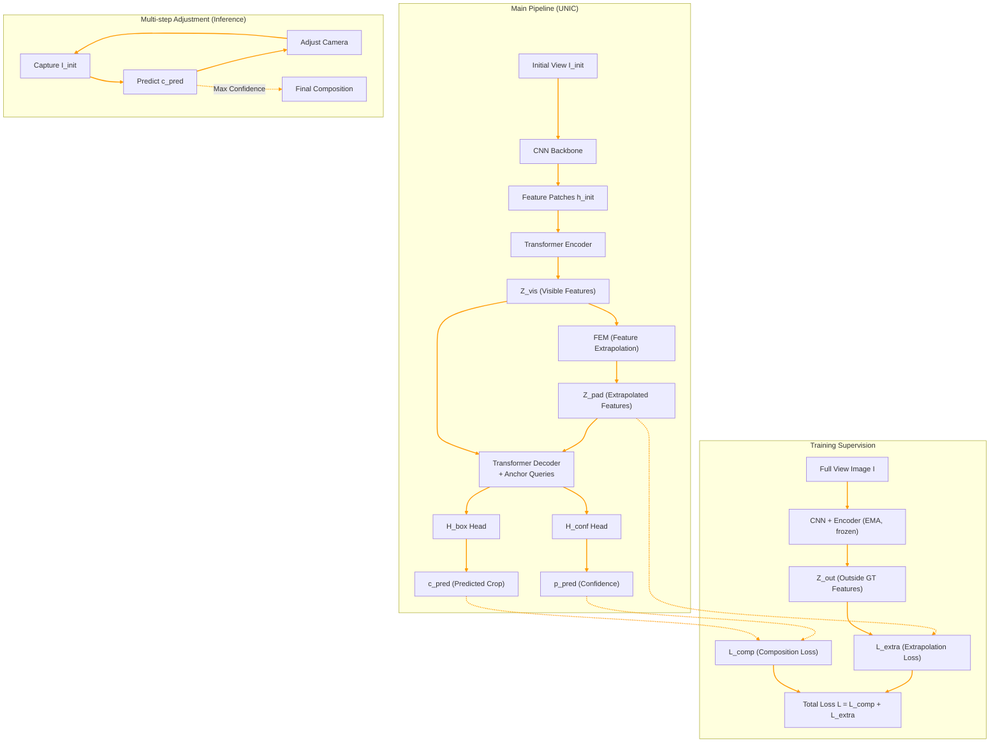

# Pipeline: Unbounded Image Composition (UNIC)

Kiến trúc của UNIC được xây dựng trên nền tảng của bài toán Image Cropping, sử dụng mô hình dạng DETR, nhưng được mở rộng với Feature Extrapolation Module (FEM) để xử lý các vùng không gian nằm ngoài ảnh.

## 1. Kiến trúc tổng thể (Overall Architecture)

Hệ thống nhận đầu vào là một ảnh ban đầu (Initial View - $I_{init}$) và xuất ra gợi ý tọa độ khung ảnh lý tưởng ($c_{pred}$) và điểm số tự tin ($p_{pred}$). 

Luồng xử lý (Data Flow) đi qua các bước sau:

1. **Trích xuất đặc trưng (Feature Extraction):** 
   - Ảnh $I_{init}$ đi qua một CNN backbone để tạo ra feature map sâu $h_{init}$.
   - $h_{init}$ được chia nhỏ thành các patches, cộng thêm Positional Embeddings.
2. **Transformer Encoder:**
   - Các patches đi qua Transformer Encoder để tạo ra các tập đặc trưng tiềm ẩn (latent features) của phần ảnh nhìn thấy được, gọi là $\mathcal{Z}_{vis}$.
3. **Ngoại suy đặc trưng (Feature Extrapolation Module - FEM):**
   - Các đặc trưng $\mathcal{Z}_{vis}$ được đưa vào FEM cùng với một learnable token $m$ và positional embeddings.
   - FEM sử dụng Cross-Attention để ngoại suy và dự đoán các đặc trưng của vùng ảnh bên ngoài biên (không nhìn thấy trong $I_{init}$), tạo ra $\mathcal{Z}_{pad}$.
4. **Transformer Decoder & Head:**
   - Cả $\mathcal{Z}_{vis}$ và $\mathcal{Z}_{pad}$ (tổng hợp lại) được đưa vào Transformer Decoder cùng với các object queries (hoặc anchors $\mathcal{A}$).
   - Hai nhánh Head riêng biệt sẽ đưa ra dự đoán:
     - $H_{box}$: Hồi quy ra tọa độ bounding boxes $c_{pred}$ (có thể nằm ngoài biên ảnh gốc).
     - $H_{conf}$: Dự đoán độ tự tin (confidence score) $p_{pred}$ cho mỗi box.

## 2. Feature Extrapolation Module (FEM)

Khác với Out-painting (sinh pixel), FEM hoạt động hoàn toàn trong không gian đặc trưng (latent space).
- **Thiết kế:** Dựa trên cảm hứng từ Masked Image Modeling (MIM), FEM gồm 6 lớp Transformer blocks. 
- Nó lấy thông tin từ $\mathcal{Z}_{vis}$ (đóng vai trò như các unmasked patches) để dự đoán nội dung của các vùng bị khuất (đóng vai trò như masked patches).
- **Lợi ích:** Tránh chi phí tính toán tạo ra pixel thực tế (như GAN/Diffusion), đồng thời giảm nguy cơ sinh ra thông tin nhiễu hoặc sai lệch làm ảnh hưởng đến quyết định bố cục.

## 3. Quá trình Huấn luyện (Training Objective)

Hàm loss tổng thể $\mathcal{L}$ là sự kết hợp của hai phần chính:

$$\mathcal{L} = \mathcal{L}_{comp} + \mathcal{L}_{extra}$$

### 3.1. Loss cho Bố cục (Composition Loss - $\mathcal{L}_{comp}$)
Được áp dụng sau bước Bipartite Matching (so khớp dự đoán với Ground Truth) như trong DETR:
- $\mathcal{L}_{reg}$: L1 Loss cho tọa độ khung ảnh.
- $\mathcal{L}_{IoU}$: GIoU Loss đo độ chênh lệch diện tích.
- $\mathcal{L}_{focal}$: Focal Loss cho điểm tự tin $p_{pred}$.
- Quá trình gán nhãn mềm (soft labels) được sử dụng để tối ưu, chuyển từ việc hướng dẫn bằng chất lượng (quality guidance) sang tự chưng cất (self-distillation) bằng mô hình EMA (Exponential Moving Average) ở các epoch sau.

### 3.2. Loss Ngoại suy (Extrapolation Loss - $\mathcal{L}_{extra}$)
Để có ground-truth dạy cho FEM, quá trình training sử dụng ảnh gốc kích thước lớn ($I$).
- $I$ được đưa qua CNN (EMA) và Encoder (EMA) để tạo ra đặc trưng toàn cảnh $\mathcal{Z}$.
- $\mathcal{Z}$ chia thành $\mathcal{Z}_{in}$ (tương ứng với $I_{init}$) và $\mathcal{Z}_{out}$ (tương ứng với vùng bên ngoài).
- $\mathcal{Z}_{out}$ được dùng làm Ground Truth để giám sát kết quả của FEM ($\mathcal{Z}_{pad}$) thông qua **smooth-$L_1$ loss**:
  $$\mathcal{L}_{extra} = smooth\text{-}L_1(\mathcal{Z}_{pad}, sg(\mathcal{Z}_{out}))$$
*(với $sg()$ là stop gradient).*

## 4. Multi-step Adjustment (Điều chỉnh đa bước)

Mô hình hỗ trợ thực thi lặp (iterative).
- Nếu góc nhìn ban đầu $I_{init}$ quá hẹp, mô hình gợi ý góc $I_1$.
- Người dùng (hoặc hệ thống) di chuyển camera đến góc $I_1$.
- Hình ảnh tại $I_1$ tiếp tục được đưa vào UNIC để dự đoán $I_2$, cứ như vậy cho đến khi đạt được khung hình có độ tự tin cực đại.
- Qua từng bước điều chỉnh, thông tin thực tế của scene sẽ dần được thu thập, giúp mô hình ra quyết định chính xác hơn thay vì chỉ dựa vào ngoại suy ở bước đầu tiên.
